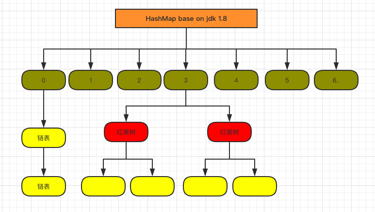

[toc]

### 目标

---

​	用c++，选取较好的数据结构，以较低时间复杂度，实现cache中的LRU算法、计算序列中的reuse distance

> 【仿真实现LRU过程】：按顺序从序列中读取一条key值；遍历key值是否在cache中；若在cache中，将其提到cache头部；若不在，先判断cache容量是否达capacity，若满，先删除尾端元素，再将其插入链表头部；否则直接插入链表头部。
>
> 【计算reuse distance】：若cache hit，计算hit的位置到栈顶的距离为a，rd[a]++；若cache miss，则rd[-1]++；
>
> 注：rd用来存储reuse distance的计数，-1表示冷启动，重用距离无穷大。

### 难点与对比

---

- LRU过程的特殊性，操作主要耗时点在于：
  - 查找：key值的遍历（耗时）
  - 删除：
    - cache满，从尾部删除一个元素，时间复杂度O(1)；
    - cache hit，需要从hit位置将原元素删除。

- 对比常用数据结构

  | 数据结构、操作 | 说明                                                         | 查找+插入                                                    | 删除                                                         | 计算rd                                   |
  | -------------- | ------------------------------------------------------------ | ------------------------------------------------------------ | ------------------------------------------------------------ | ---------------------------------------- |
  | 数组           | 1. <key,value>对 2. 属于顺序存储结构，在内存中是一块连续的存储空间； 3. 初始化时，需要确定其长度；可扩展性差 | 查找很方便按照key，O(1) 在头部插元素，不方方便，所有元素都需要向后移动，O(n)  | 删除尾巴元素：O(1) 删除中间元素：后部分元素都会移动     | 直接用地址相减，即可计算出到栈顶的距离。 |
  | map            | 1. <key,value>对 2. 链式存储，可扩展性强 3. 底层逻辑：按照key值构造红黑树 | 查找：O(log N) 头部插入：O(1)                           | 链式存储在任意位置的删除都很简单（修改链表所指的地址） **问题在于cache满时，不知道谁是最后一个元素**（若要计算所有的rd，理论上cachesize应该设置为无穷大，不涉及到删除尾端元素的操作） |                                          |
  | hash_map       | 1. JDK1.7 数组 + 链表 2. JDK1.8 数组 + 链表 + 红黑树（当链表的元素大于8时，自动转化为红黑树） 3. table中存储的是<hash(key)，*node> 4.  table实现逻辑可以看作数组，以原始key（string 类型）的hashcode作为 数组下标，对应的bucket地址作为value | 查找：O(1) + O(n)                                            | -                                                            |                                          |

  ​	                

- 难点

  - 【数据量大】数据序列为**千万、亿**级别，涉及到的不重样元素也有**百万、千万**级别，必须考虑算法的时间复杂度

​    

　