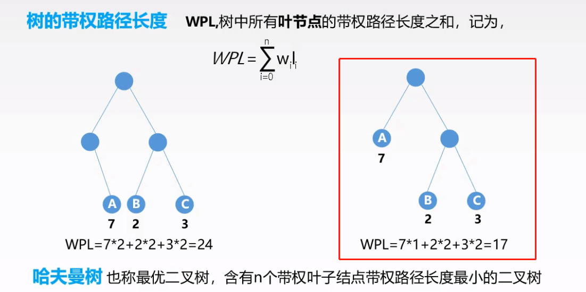

2020-12下旬~2021-01上旬，开始重新学习《数据结构》这门课程，此blog主要是视频+自己理解的记录。

<!-- more -->

# 数据结构学什么

---

<center>程序 = 算法 + 数据结构</center>

学习数据结构最主要的是，学习数据之间构建的思想。在需要的时候，结合实际的应用场景，构建出合适的结构。==运行时间友好（时间复杂度）==、==存储空间友好（空间复杂度）==。


**分析一种数据结构，需要从哪几个点考虑？**

1. 如何进行增、删、改、查等**运算**？其从内存的操作角度是如何进行的？（eg：若在数组的中间执行插入/删除操作，其后所有元素的位置都会改变。）
2. 如果要进行遍历，应该如何进行？
3. 是否支持随机访问？按照下标？
4. 该类型的扩展灵活性如何？是否固定长度？预先分配的内存空间满了，底层是如何进行容量扩展的？（按一定的阈值，复制到一定倍数的更大存储空间中.....）


# 数据结构大致框架

---

主要分为逻辑结构和存储结构。按照逻辑可分为：**线性结构**和**非线性结构**；按存储结构分可分为：**顺序存储**和**链式存储**

## 线性结构

- [x] 数组 array

  顺序表、单链表、双链表、循环链表、静态链表

  

- [x] 栈 stack（后进先出）

  __关键词：__栈顶、栈底、栈空、栈满

  栈的顺序实现、链式实现 

  **应用：**

  - 在表达式中进行括号匹配 （ { } [ ] )

  - 进行表达式求值（前缀、中缀、后缀表达式）

  -  在递归调用背后的应用（IED中有函数调用栈，在debug时可以清楚的看见函数之间的调用关系，**注意：递归调用可能导致函数栈溢出**）

    

- [x] 队列 queue（常规先进先出）

  __关键词__：队头指证、队尾指针、队满、队空

  队列的顺序实现、链式实现、双端链表（左右都可以进出、一端只可进）

  **应用**：

  - 树的宽度优先遍历

  - 图的广度优先遍历

  - OS的管理过程（buffer就可以看作一个等待队列）

    

 :star: 栈和队列可以构建结构体实现（数组+头尾指针） or 链式存储（单个节点就是一个结构体：元素+前、后向指针）

## 非线性结构

### 树

> 树是一种逻辑结构，相关的概念有：结点的度、树的高度、树的深度、路径的长度、深林
>
> 树包括很多性质
>
> - 1. 树的节点 = 所有节点的度 +1
>   2. ......

- 二叉树——每个节点的度最多为2、**可为空**、即使只有一个节点，也分左子/右子

  - 满二叉树 ——注意**满**体现在哪？

  - 完全二叉树——**完全**和**满**的构造逻辑相似，都是从左往右、从上往下。==叶子节点只可能在**最后或者倒数第二层**==

  - 二叉排序树——**便于查找** [具体内容 click here](#二叉排序树)

    > 所有左子树的值都小于根节点
    >
    > 所有右子树的值都大于根结点
    >
    > 没有值相等的两个节点

  - 平衡二叉树——**任意节点**的左子树和右子树的深度只差不会超过1

  -  [哈夫曼树](#哈夫曼树)

- 二叉树的存储结构

  - 顺序存储

    > 按照完全二叉树的标号顺序进行存储；若某一棵树不是完全二叉树，可以将其**补全（缺失位置用null）**再进行顺序存储；
    >
    > :thinking: 问题：可能导致大量存储空间的浪费

  - 链式存储

- 二叉树的遍历——根据**根节点的访问顺序**

  - 先序
  - 中序
  - 后序

- [线索二叉树](#线索二叉树)

  参考后面

### 树的存储

- 双亲表示法：用一组连续的存储空间来存储每个节点，同时每个节点中增加一个伪指针，指示双亲节点在数组中的位置。根节点下表为0，伪指针域为-1。

  ```c++
  #define MAX_TREE_SIZE 100
  typedef struct{
      Elemtype data;
      int parent;
  }PTNode;
  
  typedef struct{
      PTNode nodes[MAX_TREE_SIZE];
      int n;
  }PTree;
  ```

- 孩子表示法：将每个节点的孩子节点都用单链表连接起来形成一个线性结构

  ```c++
  #define MAX_TREE_SIZE 100
  typedef struct{
      int child;
      struct CNode *next;
  }CNode;
  
  typedef struct{
      ElemType data;
      struct CNode *child;
  }PNode;
  
  typedef struct{
      PNode nodes[MAX_TRSS_SIZE];
      int n;
  }CTree;
  ```

- 孩子兄弟表示法：用左指针-> 孩子节点；右指针-> 兄弟节点

  ==左孩子右兄弟==


### 图（待学习 2021-01-08）

---

还没学到这。。。。。。。。。。。。


# 特殊矩阵与存储压缩

---

核心思想：对于高维矩阵，==只存储有用的信息==。即按照的一定的缩减规则，将其转化为一维矩阵进行存储（按行优先or按列优先，下标的对应关系不同，需要看清楚是如何存储的。）

- [x] 普通一维数组
- [x] 二维数组（==下标与存储位置的转化！==）
  - 普通二维全存储（行or列优先）
  - 对称矩阵
  - 三角矩阵
  - 三对角矩阵
  - 稀疏矩阵
    - 用结构体存储
    - 十字链表法（ :question:  还没搞懂）

# 串的操作

---

字符串是一种特殊的线性结构，存储在**连续的一段存储空间**

**一些常规操作**：

- 子串匹配

- 子串查找

- 串的复制

- 截取子串

- ==KMP算法== :question:

  [参考链接一](http://www.ruanyifeng.com/blog/2013/05/Knuth%E2%80%93Morris%E2%80%93Pratt_algorithm.html)

  [参考链接二](https://wiki.jikexueyuan.com/project/kmp-algorithm/define.html)

  

# <font id="线索二叉树">线索二叉树 </font>

---

线索化原因：直接按照二叉树的方法设置左右节点的指针，会存在大量空指针。为了使其保存为线性结构，提高查找、检索的效率，可以按照线性存储的方式，将其前后节点的指针进行存储。

先序、中序、后续遍历都可以进行线索化。

**线索化方式：**

- 若无左子树，则左指针指向其前驱节点
- 若无右子树，则右指针指向其后继节点

**flag标志：**

- 解决问题：为了标记指针指向的节点是==前驱节点==还是==孩子节点==
- flag = 0 :表示child域指向的是节点的孩子节点
- flag = 1:表示child域指向的是前/后继节点

```c++
typedef struct ThreadNode{
    Element data;
    struct TreadNode *lchild, *rchild;
    int ltag, rtag;
}ThreadNode, *ThreadTree;
```

# <font id="二叉排序树">二叉排序树(BST)</font>

---

主要操作：**查找**、**插入**

- 查找
  - 查找效率 O(log N)  - O(n)，极端情况下会退化成线性链表
  - 故必须保证其平衡性，引入[平衡二叉树](#二叉平衡树)
- 插入
- 构造二叉树 ==  插入
- 删除 [参考连接](https://blog.csdn.net/zxnsirius/article/details/52131433)
  - 叶子节点（直接删除）
  - 若只有一颗子树
  - 若有两颗子树（找到其右子树的最左节点）

```c++
  // 查找【非递归】
  // 传入三个参数，树的根节点、待查找的元素，指向待遍历节点父节点的指针（在此处没有用到）————查询不需要修改参数值，所以不以引用的方式进行值的传递
  // 返回值：指向某个节点的指针
  BSTNode *BST_Search(BiTree T, EleType key, BSTNode *&p){
      p = null;
      while(T!=Null && key != T -> data){
          p = T;
          if(key < T -> data)
              T = T -> lchild;
          else
              T = T -> rchild;
      }
  }
```

```c++
// 插入
int BST_Insert(BiTree &T, keytype k){
    // 若原树为空，则插入为根节点
    if(T == Null){
        T = (BiTree)malloc(sizeof(BSTNode));
        T -> key = k;
        T -> lchild = T -> rchild = Null;
        return 1;         
    }
    else if(k == T -> key)
        return 0;
    else if(K < T -> key)
        return BST_Insert(T -> lchild, k);
    else
        return BST_Insert(T -> rchild, k);
}
```

# <font id="二叉平衡树">二叉平衡树</font>

---

平衡：==左子树的高度和右子树的高度绝对值只差不会超过1==

```c++
// 利用后序遍历的方法，递归的判断一棵树是否平衡

void Judge_AVL(BiTree bt, int &balance, int &h){
    int bl = 0, br =0, hl = 0, hr = 0;
    if(bt == Null){
        h = 0;
        balance = 1;
    }
    else if(bt -> lchild == Null && bt -> rchild = Null){
        h = 1;
        balance = 1;
    }

    else{
        Judge_AVL(bt -> lchild, bl, hl);
        Judge_AVL(bt -> rchild, br, hr);
        
        if(hl > hr)
            h = hl + 1;
        else
            h = hr + 1;
        if(abs(hl - hr) < 2 && bl == 1 && br == 1)
            balance = 1;
        else
            balance = 0;
    }  
}
```

平衡二叉树的插入 =  ==二叉树的插入 + 平衡调整==

**调整方法**

- 左旋
- 右旋
- 先左后右旋转
- 先右后左旋转

# <font id="哈夫曼树">哈夫曼树</font>

---

几个定义

- 带权路径长度——WPL

  

- 性质

  - 每个初始节点都会成为叶结点，双亲结点都为新生成的节点
  - 权值越大的结点离根结点越近，反之越远
  - ==哈夫曼树中没有度为1的节点==

- 应用

  - 对字符串进行编码

    - 固定长度编码
    - 可变长度编码（存在问题，二进制转化为字符串时，因为长度不固定，反向转化时，不清楚应该在何处进行分割）

    **需要使每个字符的二进制均不为其它字符的前缀**——构造哈夫曼树，可以解决。

# 后记

---

主要是自己对数据结构学习过程的知识梳理、总结等。。。

学习视频链接：[click here](https://www.bilibili.com/video/BV1b7411N798)

