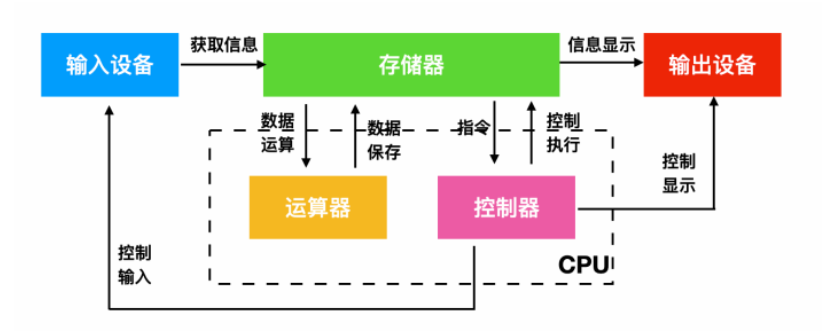
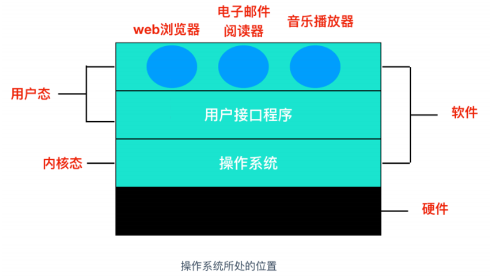

2020年12月下旬，学习了计算机四大基础课程之一的《操作系统》，主要用到的资料是B站上的视频：[王道考研](https://www.bilibili.com/video/BV1YE411D7nH)，以及一些参考博客链接：

<https://www.cnblogs.com/cxuanBlog/p/13297199.html>

<!--more-->

[Toc]

## 引论

---

### 什么是操作系统？

- 定义：

  操作系统是一组==**控制和管理计算机硬件和软件资源、合理地对各类资源进行管理的软件系统**==（口语化：基于现有的硬件基础，安装一层软件，软件可以根据用户数的指令达到控制硬件的效果，从而满足用户的需求）

  > key word：计算机上运行的最重要的**软件**；管理着计算机的**内存、进程、所有硬件、软件**；协调cpu、内存、存储器等，确保每个程序获得它所需要的资源。
  >
  > 计算机硬件的重要组成部分：运算器、控制器、存储器、输入设备、输出设备
  >
  >
  > CPU有两种状态：内核态（特权指令）+用户态 （非特权指令） 	

  

  

- 操作系统提供的抽象模型：

  - 文件：对I/O设备的抽象
  - 虚拟内存：对程序存储器的抽象
  - 进程：对正在运行程序的抽象
  - 虚拟机：对整个操作系统的抽象

  

- 需要思考的几个问题？

  - 操作系统是如何工作的？【os运行在内核态】
  - **如何有效的解决并发问题？**
  - ......

- ==os的特征==

  - 并发性
  - 共享性
  - 虚拟性
  - 异步性

- 功能和目标

  - 方便用户与计算机硬件之间的通信
  - 提供用户图像界面
  - 。。。。

### 一些概念

---

- 中断/异常机制： CPU暂停当前执行程序，保留现场，硬件自动转去处理程序，处理完后回到断点，继续执行被打断的程序。
- 系统调用：应用程序可以通过库函数和API进入系统调用，也可以引发系统调用，系统调用再调用对应的内核函数。
- 并发程序：一段时间内，单处理器上多个程序处于开始运行但未结束的状态，且次序不是事先确定的。
- ==中断是唯一一个从用户态切换到内核态==

## 进程(process)和线程(thread)

---

### 进程

---

进程：os分配资源的最小单位

==一个cpu/核在一个特定时刻只能运行一个线程==，之所以会产生多个程序**并行**。每个进程都有自己的虚拟CPU，但实际情况是，CPU会在各个进程之间来回切换。

进程实体：程序段、数据段、PCB(process control block)

> PCB：是非常重要的以一个概念，包括os对进程的基本描述信息、控制管理信息、资源分配信息。
>
> > 进程控制PCB块，进程描述（PID、用户标识、进程组关系）、进程控制（状态、优先级、入口地址、队列指针）、资源和使用状况（存储空间、文件）、CPU现场（进程不执行时保存寄存器的值、指向页表的指针）
>
> UID：表示进程的创造者
>
> PID：进程的名字

- 进程队列
  - 每类进程状态有一个或多个进程多列、队列中的元素未PCB块，进程状态改变就是换队。
- **进程的层次结构**
  - unix
    - 所有”进程+子进程+子进程的子进程。。“共同构成一个进程组，当接受到一个信号时，可以各自选择捕获、忽略、采取默认动作等
    - 整个操作系统的所有进程都隶属于一个以init为根的进程树
  - windows
    - 不存在层次的概念，所有进程平等
    - 但是父进程拥有控制子进程的特别令牌==句柄==

- 进程的状态
  - 运行态：占用CPU资源
  - 就绪态：可以运行，但是因为其它进程占用CPU而需要**等待**
  - 阻塞态：除非某种外部事件发生，否则进程不能运行（等待用户输入scanf）
- 进程的实现
  - what is 进程表？
    - OS为了==执行进程之间的切换==所维护的表（process table），每个进程占用一个进程表项（**一行**），包含了进程状态的重要信息，eg:程序计数器、堆栈指针、内存分配状态、打开文件的状态、账号和调度信息、以及其它在进程由运行状态转换到就绪或阻塞时所必须保存的信息。
  - 一个进程在执行过程中可能被中断数千次，每次中断后，被中断的进程都返回到与发生中断前完全相同的状态。

### 线程

---

- 为什么要在进程的基础上引出线程的概念？
  - 1. 多线程之家共用一片地址空间和所有可用数据的能力，不用频繁切换，==多进程不具有==；
    2. 线程比进程更加轻量级，更容易创建、撤销等（创建一个线程比一个进程快10-100倍）；
    3. 从性能方面考虑，若是CPU密集型，则性能很难增强；若是I/O密集，则可以有效提高计算速度

### 进程间的通信

---

进程之间必须通过频繁的信息交流，此问题称为**进程通信问题**（Inter Process Communication，IPC）问题。进程通信机制可以分为以下

6种。

- 信号（Single，通过向一个或多个进程发送异步事件信号来实现；信号可以从键盘或者访问不存在的位置产生；信号可以通过shell将任务发送给子进程）
- 管道（Pipe，进程之间可以建立同步通信管道，一方向其写入字节流，一方从中读取字节流）
- 共享内存（Share Memory，利用共享内存，操纵共享变量来实现通信）
- 先入先出队列（更有保障的管道，named pip）
- 消息队列（描述内核寻址空间内的内部链接列表）
- 套接字（Socket，提供端到端的双向通信）

### 调度

---

- why调度——scheduling algorithm？
  - 计算机是多道程序设计系统时，若有两个及以上的线程/进程处于就绪状态，就存在cpu资源的竞争，==以何种顺序、何种策略==进行程序的运行，是**调度程序**需要解决的问题。
- 调度算法分类：
  - 批处理（先来先服务、最短作业优先、最短剩余时间优先。。。。）
  - 交互式（轮询调度【按照时间片】、优先级调度、多级队列调度、最短进程优先、保证调度【确保每个用户都被分配一定的处理能力】、彩票调度【类似于抽奖？抽运行时间】、公平分享调度【】）
  - 实时（周期性、非周期性。。。）

### 死锁

---

what is 死锁？

> 在并发环境下，相互等待对方手里的资源，导致经常阻塞、无法正常运行
>
> 饥饿：进程缺少某种资源而无法继续执行
>
> 死循环：一直跳不出循环

死锁的条件：

- ==条件一==：资源互斥、不可剥夺条件、请求和保持条件、循环等待（**循环等待未必会导致死锁，但死锁一定存在循环等待**）

- ==条件二==：对不可剥夺资源的不合理分配

  

## 地址空间

---

### why 提出地址空间？

> 要使多个应用程序同时运行在内存中，必须解决两个问题**保护**和**重定位**
>
> 解决==保护==——”保护密钥标记内存块“

### 如何解决程序运行过程中内存不足？

- 交换（swapping）
  把一个进程完整调入内存，运行一段时间之后，再放回磁盘；空间的进程会存储在磁盘中，只有当需要运行的时候才会再调入。

  - 涉及到的知识点
    - 利用bitmap、free lists等方式进行内存监控
    - 利用**链表**维护已分配的内存段和空闲内存段，

- 虚拟内存（virtual memory）——**允许应用程序部分的运行在内存中**

  > 基本思想：每个程序都有自己的地址空间，这个地址空间被划分为多个称为`页面(page)`的块。每一页都是连续的地址范围。这些页被映射到物理内存，但并不是所有的页都必须在内存中才能运行程序。当程序引用到一部分在物理内存中的地址空间时，硬件会立刻执行必要的映射。当程序引用到一部分不在物理内存中的地址空间时，由操作系统负责将缺失的部分装入物理内存并重新执行失败的指令。

- 几个概念
  - 页表：目的是把虚拟页映射到页框中
  - 页表项：与机器有关，但通常包括：**高速缓存禁止位、访问位、修改位、保护位、在/不在位、页框号等**

- 页面置换算法
  - 最优算法
  - 最近未使用算法
  - 先进先出算法
  - 第二次机会算法
  - 时钟算法
  - NFU（最不经常使用算法）

- ==自己理解==

  - 逻辑地址：按照**进程**分配的连续存储单元  ==逻辑地址 = 页号 + 页内地址==

  - 物理地址：实际占用的内存杀的地址 ==物理地址 = 块号 + 块内地址==

    

## 文件系统

---

文件的组织方式：

- 结构化（db、excel）
- 非结构化（txt、二进制文件、流文件等）

OS需要实现的文件管理功能

- 文件共享
- 文件保护

文件的目录、文件的物理结构、文件的分配方式、存储空间管理、基本操作、文件共享（硬链接、软连接）、文件保护（口令保护、加密保护、访问控制）

## 磁盘系统

---

key word：柱面号、盘面号、扇区、

- 磁盘调度算法
- 磁盘时间消耗：==寻找时间 + 延迟时间 + 传输时间==
- 减少磁盘延迟时间的方法？
  - 交替编号（避免逻辑相邻的数据，物理空间也相邻。**每次读取完一个扇区的数据，需要一定的时间用于数据准备**）
  - 错位命名（盘面、楼上楼下交替命名）
- **思考：为什么要以（柱面号 盘面号 扇区号）**命名，而非~~（盘面号 柱面号 扇区号）~~的形式？？

##　IO设备

---

。。。。。

。。。。。

##　后记

初步笔记，完善ing