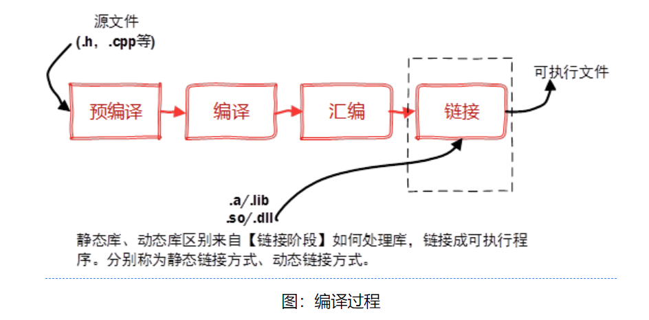
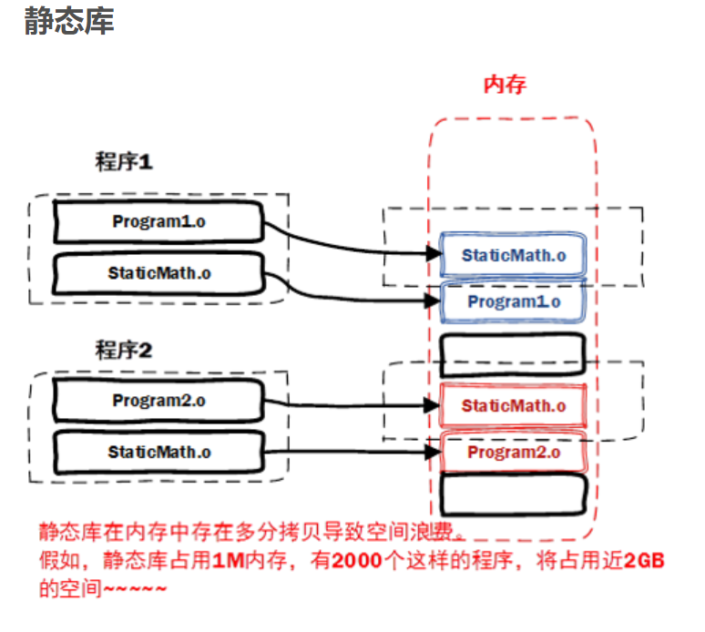
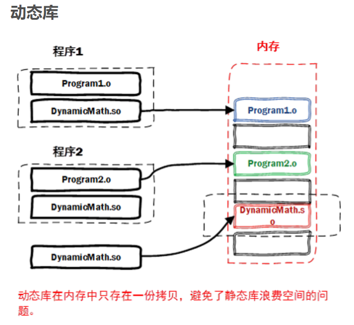

### 函数调用发生了什么？

### 几种排序算法

### 不能调用非静态函数？

### sort的用法，迭代，反向迭代器？


### 静态库、动态库——实现代码的复用



- [静态库](https://www.cnblogs.com/jiqingwu/p/4325382.html)`g++ `

  

  - 一般为.a .lib文件
  - 会将生成的汇编.o文件与用到的库文件一起打包生成exe文件，==移植性好==

- 存在问题

  - exe文件会变的很大，形成空间浪费
  - 更新很麻烦（如果eg：一个文件中小小的更新，因为用的是静态库的方式（已经编译成exe文件）需要用户重新下载）

- [动态库](https://www.cnblogs.com/jiqingwu/p/linux_dynamic_lib_create.html)

  

  - 一般为.so  .dll（shared object）
  - 在内存中只有一份，当程序需要用到的时候才会载入
  - 可以方便更新、部署（实现增量式更新）

  > ！！！非常坑了！！！
  >
  > 在minGW下用g++链接动态库 不会自动补全，需要输入全称libxxx.so。
  >
  > [参考链接](http://www.soolco.com/post/94572_1_1.html)

### c++编译执行的逻辑

- xxx.h文件不会编译，只是在预处理阶段，将所有#include<"xxx.h">的文件替换成头文件
- 每个xxx.cpp文件会被编译生成对应的obj文件，最后再通过将所有的obj文件link，构成exe文件  


- 关于声明和定义【变量和函数都是一样】

  - 声明是向计算机介绍，它叫什么名字

  - 定义：编译器对其分配内存空间；确定变量占多少内存。

  - 定义 可以是 声明。

    > 如果在头文件中写`int a`，此时并没有指定a的值为多少，但依旧是定义
    >
    > 计算机首先看是否有a这个变量，如果没有就创建
    >
    > 如果只是想声明变量，而不需要马上分配内存，`extern int a`.==只是声明==
  
  ### C++ 初始化规则
  
  - 取决于
  
    - 变量的类型（静态变量与否？是否内置变量？）
    - 变量的位置（函数内、外）
  
  - 内置类型变量
  
    - 函数体外，表示为全局变量，自动初始化为0
    - 函数体内，不自动初始话（==随机数==）
  
  - 类类型的变量
  
    - 没有构造函数时，编译器会调用默认构造函数，即数据为内置类型时（==同上==）
    - 有构造函数（有些数据类型没有默认构造函数，必须显示定义构造函数），在定义对象的时候必须显示指定其初始话值（==无论在什么位置==（函数内/外））
  
  - 数组
  
    - 静态数组（==同上==）
  
    - 动态数组
  
      - 数组元素为内置类型（不初始化）
      - 数组元素为类类型（调用默认构造函数）
  
      ``` 
      int *ptrA = new int[10];  // 不初始化
      int *ptrB = new int[10]() // 表示对数组元素初始化
      ```

### c/c++中static关键字

> static的意思是静态的（与之相对应的是动态的），是c/c++中均有的一个关键字，主要作用分为三个
>
> - 扩展生存区——用static修饰的局部变量，其作用域变成了整个程序
> - 限制作用域——用static修饰的全局变量or函数，表示该作用域仅为该文件；如果其他文件用extern的方式，获取的不是同一个
> - 唯一性——主要是针对静态数据成员、成员函数

- 静态成员变量

- 静态成员函数

- 静态全局变量——==作用域为声明它的整个文件，其他文件不可见==

  > vs 全局变量，作用域不用；前者只能在本文件中访问，后者作用域为整个工程，可以extern来访问
  >
  > 不同文件下都可以调用该变量的声明，但是不是同一个，不会造成冲突

- 静态局部变量

  > 作用域为整个

- 静态函数

```c++
clase testClass{
public:
 
}
```

### __declspec(dllexport)


### 类的构造

```c++
// h文件里面写类的声明
// 为了避免重复被定义
#pragma once   // 只能保证同一个文件不会被编译多次，但是当两个不同的文件内容相同时，仍然会出错（微软平台才适用）
#ifndef __A_HPP__   // 避免头文件被重复加载;可以适用于不同平台
#define __A_HPP__
class A{        // 此部分为类的声明，只是高数编译器 类的规格和尺寸，并不进行实际的初始化。类中的静态成员函数，也不应该在头文件的类外进行定义（初始化）
public:
    A(int a, int b);
    ~A();
    void func();
private:
    int _a,_b;
}      
#endif
// cpp文件里写类的定义
#include"A.h"

A::A(int a, int b):_a(a),_b(b){
    
}

A::~A(){
    
}

A::func(){
    
}


// main文件中
#include<a.h>

int main(){
    A a;  // 新建一个对象a, a的作用域在{}内，离开{}自动调用析构函数
    A b = new A();  // 利用new在堆区开辟空间，创建新的对象，离开作用域之后额内存不会自动释放
}
```


### vector的push_back和emplace_back()

- push_back(）：首先创建该元素，然后将其复制/拷贝到vector的尾部==（首先选择移动构造、如没有再选择拷贝构造）==
- emplace_back()：直接移动，省去了复制/拷贝的过程

```c++
class T{
public:    // 更具传入参数的类型区分？
    T(const T&):  // 拷贝构造
    T(T &&) // 移动构造 输入必须是右值？  push_back(a),如果a是临时对象，则会先构造一个新的，再拷贝
    T& operator=(const T&) // 拷贝赋值
    T& operator=(const T&&) // 移动赋值 
}
```


### c++中的new和delete

> - 应用场景1：动态数组
>
> 新建一个数组的时候，`int a[10] or int a={1,2,3}`必须在创建的时候明确指定其大小（数据存在堆区，堆是压缩分配，所以在大小必须固定），不能用`a[n]`
>
> 如果数组的长度不固定，需要在使用的时候不断增加器长度or初始顺序不固定。==用new手动分配变量到堆区，如果不调用delete[] a，则即使程序结束之后，分配的内存也不会被释放（可能需要重启计算机）==
>
> - 利用new新建一个对象，必须要用delete
> - 用new[]，必须配合delete[]

- new a[]的时候，开辟的内存之前，还有4个字节，用于保存这个数组的长度

- delete[]的时候，会根据最前面保存的数组的长度来作为调用析构函数的次数，然后再删除指针。

  如果不加[]，对于内置对象/没有重新自定义析构函数的问题不大（eg int），如果自定义了析构函数，则会因为没写[]，只调用一次析构函数，从而导致内存泄漏。

[参考链接](https://blog.csdn.net/u010732356/article/details/53958293)

### __cplusplus宏

> 表示编译器是按照c还是c++语法来解析，在gcc中是没有定义改宏的，g++中则有

### c++ 内置函数

- strlen(str)、str.length()、str.size（）的区别

  - C/C++ strlen(str)和str.length()和str.size()都可以求字符串长度
  - 其中str.length()和str.size()是用于求string类对象的成员函数
  - strlen(str)是用于==求字符数组的长度，其参数是char*==

  ```c++
  #include<iostream>
  ```

### 读取和输出

- cin
  - cin是istream类的对象，主要逻辑是从==缓冲区==读取数据 （从键盘输入时，敲一下回车才会将数据传输到buffer）
    - 当缓冲区为空，阻塞程序，等待数据的到来 （直到遇到文件结束符（linux 为ctrl + z ? EOF），否则会一直被阻塞。）
    - 一旦buffer有数据，触发cin的成员函数去读取数据
  - cin >>  以空格、tab、换行作为分割符
  - `while (cin >> i){.....}`