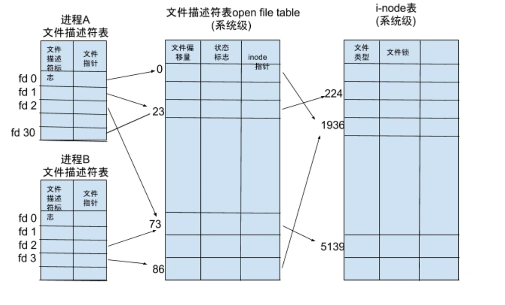
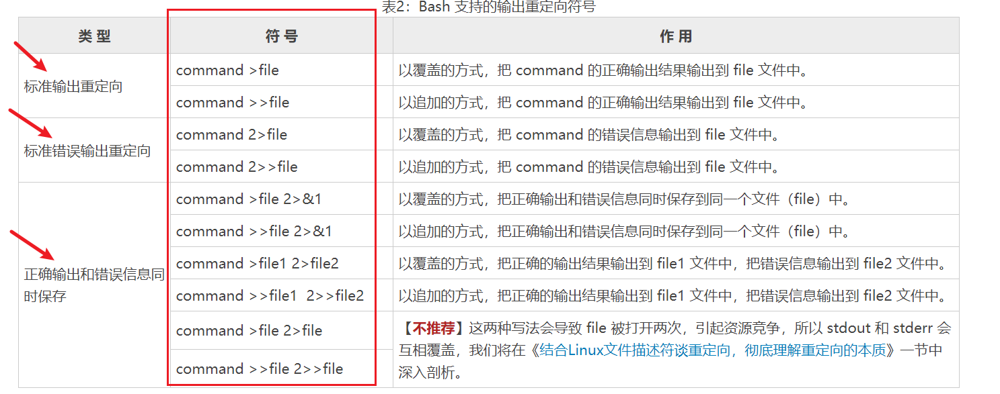
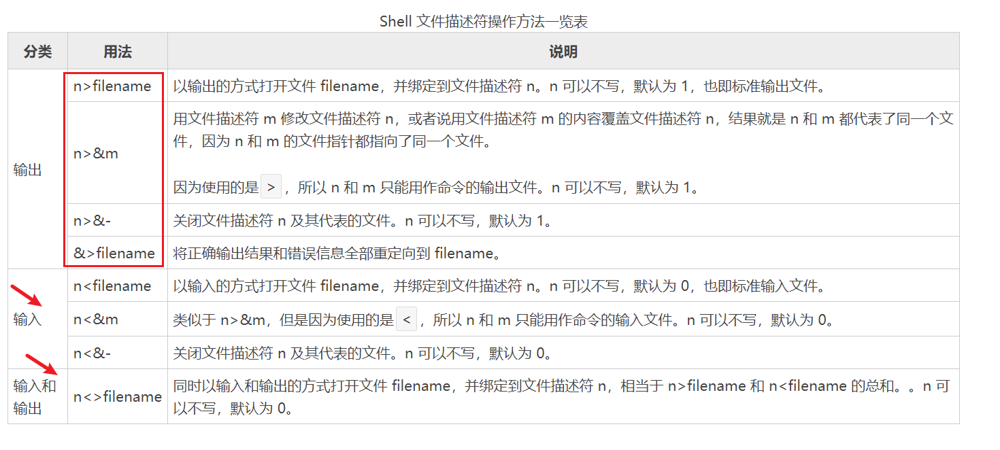

### shell经典语法

```she
# 统计文件夹下 各个文件的行数
find ./ -name '*.cnf'|xargs wc -l    

# 生成遍历迭代
for i in {1..255};do
{

}

# exec的用法
## 利用exec打开一个文件
exec 6<> ${filename}

## 利用exec删除一个文件
exec 6<&-

```

- sed 操作

```she
```


### 命名管道

- 一般之前用 cat filename|grep ".log"，相当于创建的是匿名管道

- 管道 ！=常规文件 ，读完一次就没了

- 管道是也是一个文件

  

### 文件描述符(file descriptor)

> [维基百科](https://zh.wikipedia.org/wiki/文件描述符):文件描述符在形式上是一个非负整数。实际上，它是一个索引值，指向内核为每一个进程所维护的该进程打开文件的记录表。当程序打开一个现有文件或者创建一个新文件时，内核向进程返回一个文件描述符。在程序设计中，一些涉及底层的程序编写往往会围绕着文件描述符展开

- 非负整数，表示内核为每一个进程所维护的打开的文件记录表，是一个索引值。
- 打开、创建一个文件时，会返回一个fd

```she
ps -aux |grep xxx # 获取xxx的进程id为1234

cat /proc/1234/limits  # 查看id为1234的进程限制的  max open files

ll /proc/1234/fd/ |wc -l # 统计1234进程已经占用的fd数量
```




- 文件描述符一般可以是非负整数（一般比较小），但是有几个特殊的
  - 0 表示标准输入的fd
  - 1 表示标准输出的fd
  - 2 表示标准错误输出的fd

- 输出重定向

  

==注意==

1. 一般形式为 command + fd>filename
2. fd和>/</<</>> 之间不能有空格，否则会被解析错，重定向符号和filename之间的空格可有可无