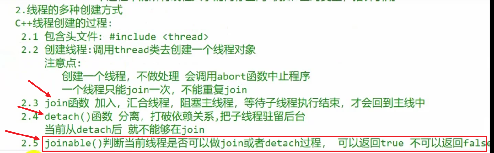
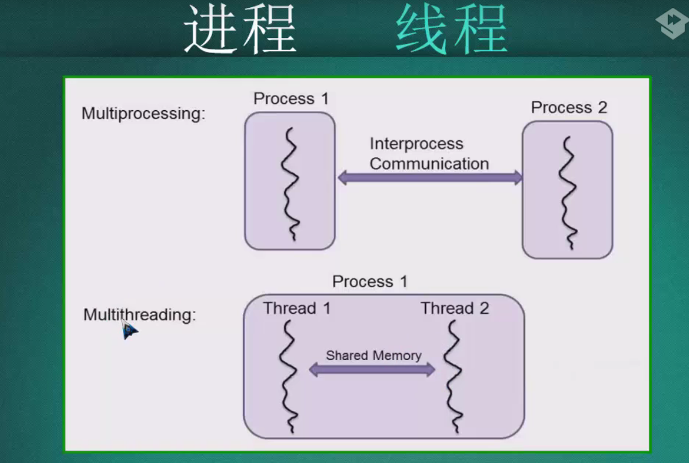
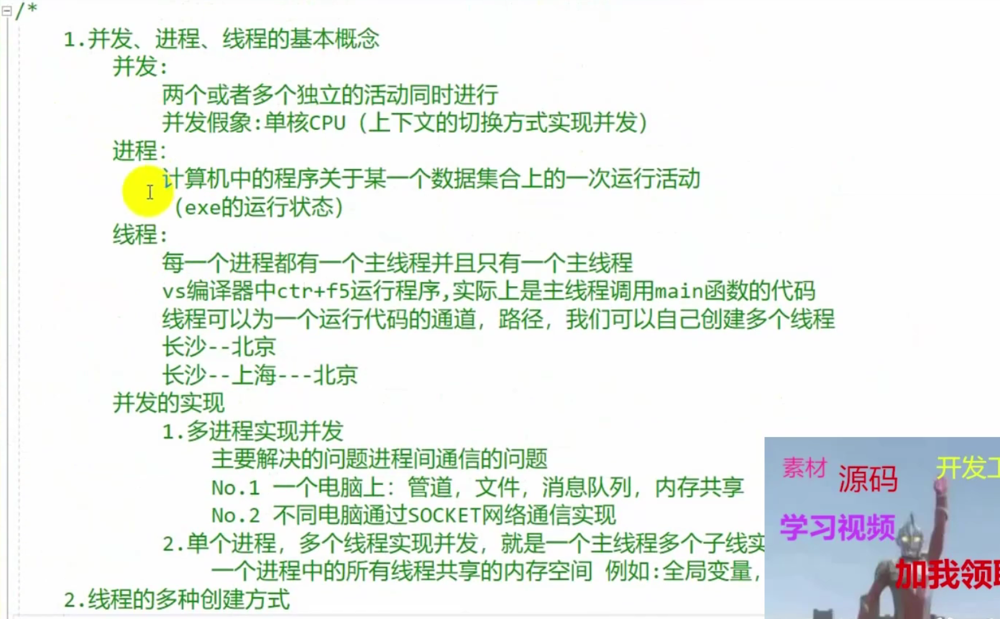

### c++ 多线程和多进程

> c++多线程是多任务处理（让电脑同时运行>=2个的程序）的一种形式，一般包括基于线程thread和基于进程proces
>
> - process 利用文件or管道进行数据交互，==程序的并发执行==
> - thread 主要通过共享内存，==程序片段的并发执行==

### thread

```c++
/*
创建线程的方式
1.普通函数 2.通过类的对象 3.lamda表达式
4.带参f

*/

#include<iostream>
#include<thread>
#include<windows.h>   // sleep的头文件

void foo(){
    Sleep(5000);  // sleep 5000ms
    std::cout << "this is thread1" << std::endl;
}


void foo2(){
    Sleep(5000);  // 注意单位是ms
    std::cout << "this is thread2" << std::endl;
}

int main(){
    std::thread t1(foo);
    std::thread t2(foo2);
    // t1.join();    // 只有子线程执行结束才会继续主线程
    // t1.detach();   // detach将子线程和主线程分离

    //t1.join();
    //t2.join();
    t1.detach();
    t2.detach();
    std::cout << "main thread is finished!" << std::endl;
}
```



### pthread


#### multiprocess VS multithrea



