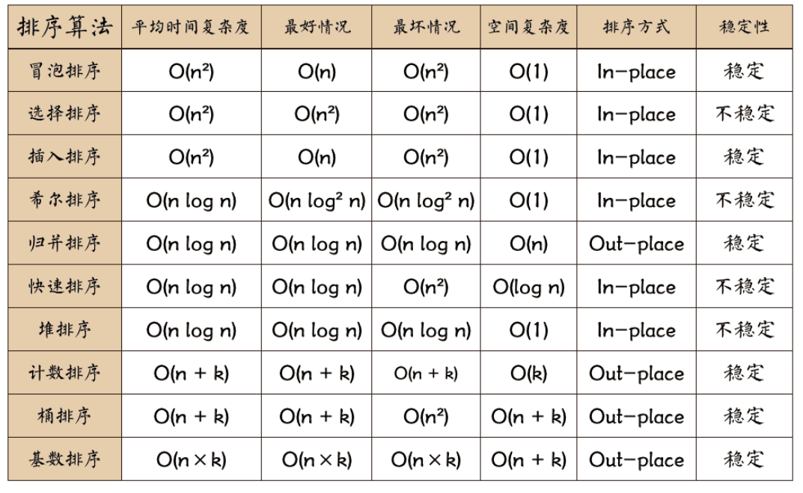
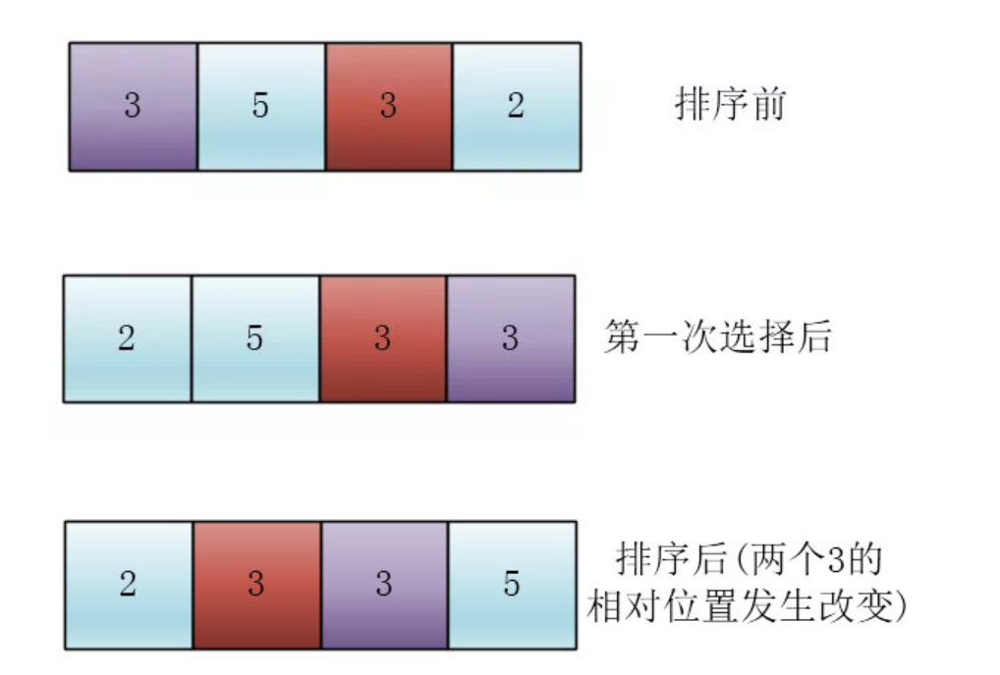

## 常考算法

[知乎参考链](https://zhuanlan.zhihu.com/p/42586566)

[菜鸟教程](https://www.runoob.com/w3cnote/ten-sorting-algorithm.html)



### 冒泡排序 bubble sort

```c++
int* BubbleSort(int* arr, int length){
    for (int i = 0; i < length -1; i++){
        flag = true
        for(int j = length -1 ; j > i ; j--){
            if (arr[j]<arr[j-1]){
                flag = false;
                int tmp = arr[j-1];
                arr[j-1] = a[j];
                a[j] = tmp; 
            }
        }
        if (flag) break;
        }
    return *arr;
}
// 一种优化方法，利用flag来判断，当一次内循环之后没有发生变量交换，则直接结束，跳出循环

```

### 选择排序 selection sort

```c++
// 思想：依次往后找第一个最小元素、第二小元素、第三小元素
template<typename T>
void selectionSort(std::vector<T>& arr){
    for(int i = 0; i < arr.size(); i++){
        int min = i;
        for (int j = i; j< arr.size(); j++){
            if(arr[j+1] < arr[j])
                min = j;
            std:swap(arr[j],arr[j+1]);
        }
    }
}
```



### 插入排序 insertion sort

```c++
// 将未排序的元素，一个一个插入地排到有序数列中
//  主要用于规模较小，数据基本有序的时候
void insertion_sort(int arr[], int len){
	fot (int i = 0;i < len;i++){
        int key = arr[i];
        int j = i - 1;
        for(j; j >=0 ; j--){
            if (key < arr[j]){
                arr[j+1] =arr[j];
            }
            arr[j+1] = key;
        }
    }    
}
```

### 希尔排序 shell sort

```c++
// 主要思想是【先分组】+【再排序】
// 不同的增量序列，带来的算法复杂度也不一样；目前也没有证明哪一种增量序列一定好

template<tyepename T>
void shell_sort(T arr[], int len){
    // 得到增量序列
    int h = 1;
    while(h < length/3){
        h = 3 * h + 1;
    }
    
    while(h >= 1){  // while完成一种分组的排序
        for (int i = h; i< len ; i++){ // 对h之后的所有变量做c
            for(int j =i; j >= h && arr[j] < arr[j-h]; j -= h )  // 一次for循环，做一次插入排序
                std::swap(arr[j], arr[j-h]);
        }
        
        h = h / 3;
    }
}


```

