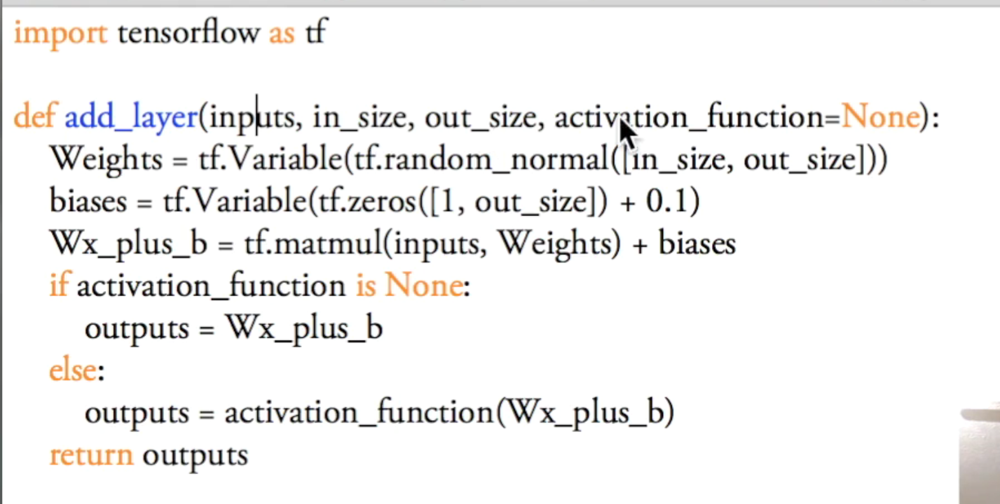

- 基础用法——variable

  ```python 
  import tensorflow as tf 
  
  
  state= tf.Variable(0, name = 'counter')  # 必须要显式的指定是变量还是常量
  print(state.name)
  
  one = tf.constant(1)
  
  new_state = tf.add(state, one)
  update = tf.assign(state, new_value)  # 新的变量必须要通过这种显式指定的操作来赋值原变量
  
  init = tf.initialize_all_variables()  # 只要有定义变量，就必须定义初始化操作，否则只是一个图的框架
  
  with tf.Session() as sess:
      sess.run(init) # 必须要初始化
      for _ in range(3):
          sess.run(update)
          print(sess.run(state))
  ```

- placeholder——希望在run的时候才传入变量的值

  ```python
  import tensorflow as tf 
  
  input1 = tf.placeholder(tf.float32)
  input2 = tf.placeholder(tf,float32)  # 需要指定变量的类型
  
  output = tf.mul(input1,input2)
  
  with tf.Session() as sess:
      print(sess.run(output, feed_dict={input1:[7.],input2:[2.]}))
  ```

- 自定义层——define layer

  

- 构造神经网络——build a neural network 