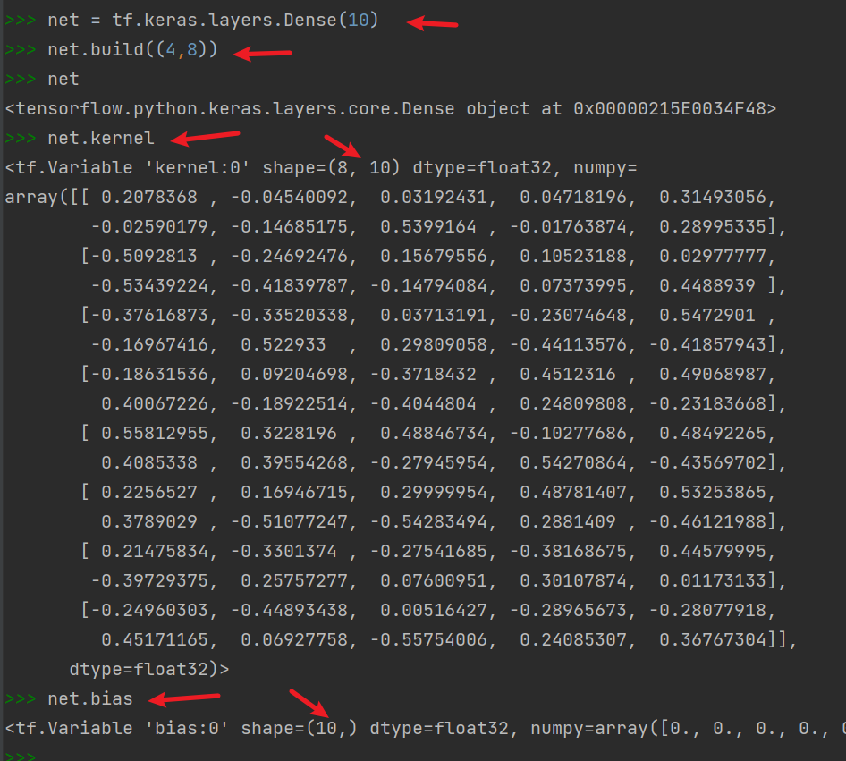
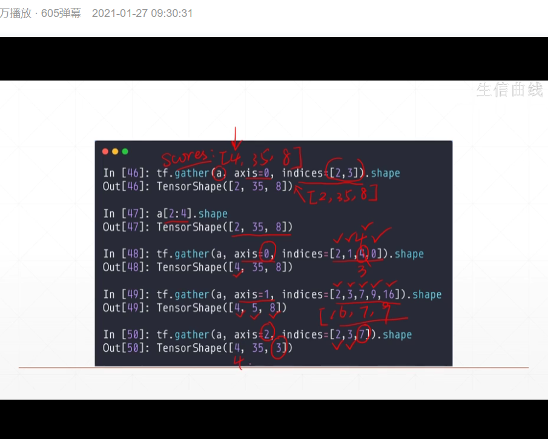
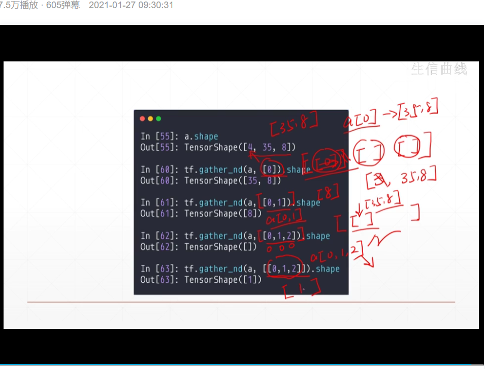
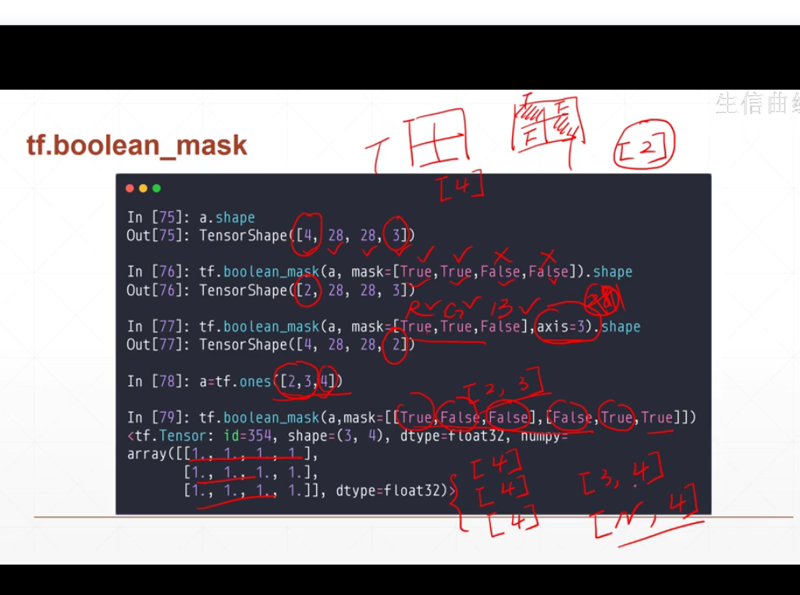
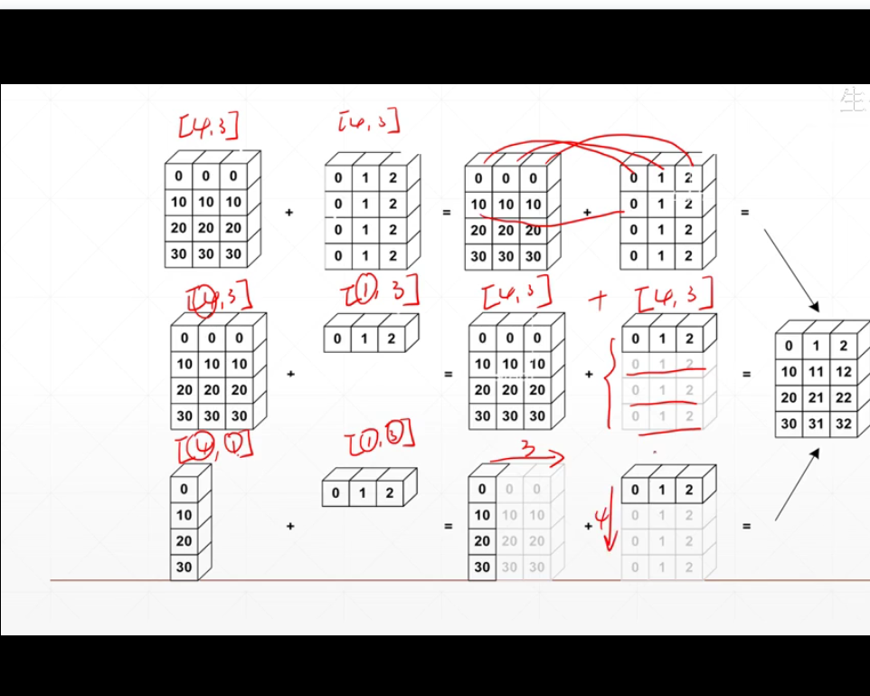
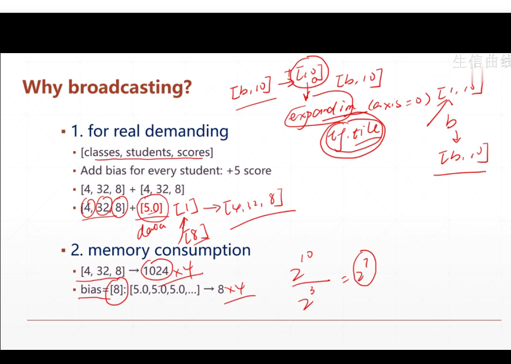
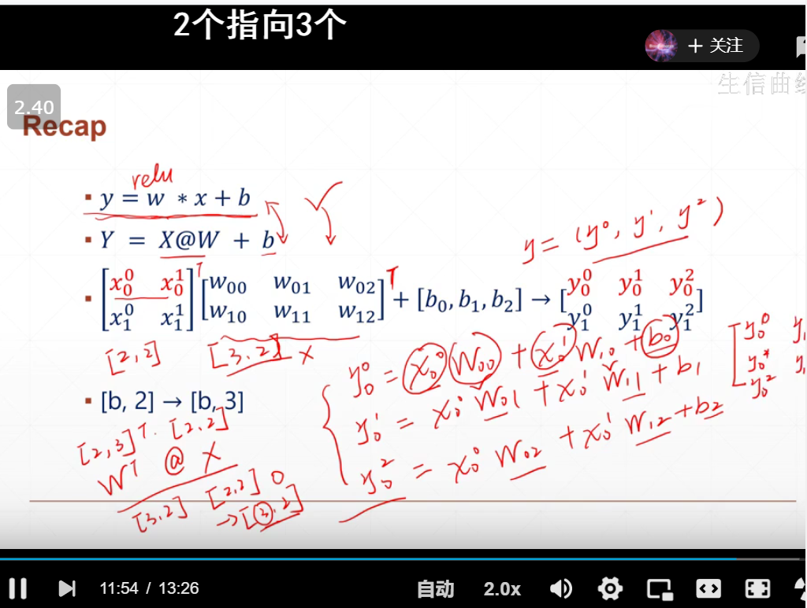

- tensor和numpy可以相互转换，tensor的计算效率更高
- tf.Variable()：是创建一个变量，默认的告诉机器，这个tensor在训练过程中，可以计算梯度（区别于普通的tensor）
- tf创建tensor
  - 从numpy中转化， tf.conver_to_tensor()
  - tf.zeors([shape])
  - tf.zeors_like()   
  - tf.fill(shape, data)
  - tf.constant()
  - 随机初始化
    - tf.random.normal()
    - 

- 某一层神经网络的神经元的个数 = 输出的维度

  - w = [d_in,d_out]， wij 表示第i个维度的输入，从第j个维度输出的权重
  - b = [d_out]，bi表示第i个输出维度的偏置

- 用API构造网络

  ```pytho
  net = tf.kears.layers.Dense(10)  #构造有10个输出的全连接层
  net = tf.build((4,8))  # 设置改层的输入维度
  net.kernel   # 相当于得到该层的w, 已经用默认的方式进行随机初始化了
  net.bias  # 得到该层的b
  
  ```

  

  

- 对数据进行切片

  - 区别scale 和 vector
  - a:b
  - a:b :step  eg:  : : -1  逆序采样、某步长采样
  - ....   省略号采样，写的更加简洁，只要其逻辑上能够推导
  - 按照index 进行采样
    - tf.gather (a, axis, [ ])  a的数据维度表示：有x个班级，每个班级有y个学生，每个学生有z门成绩 【每个维度都进行同样采样】
    - tf.gather.nd(a,需要分别在各个维度上采样的索引)
    - tf.boolean_mask()  ;用axis = ? 对指定维度进行采样 

  

  




- 维度变换: 总的数据量不变，但是修改其对应的view（把总量相同的data装到不同的container里面）
  - 【可以用axis指定对应的维度】
  - tf.reshape   
  - tf.transpose
  - tf.expand_dims
  - tf.squeeze

- broadcasting

  - 确保小维度对齐（右端对齐）——默认扩张规则
  - 可以节约内存

  



- 矩阵运算
  - 

- 张量的合并与切割

  - tf.concat：指定维度进行合并，不会create new dim
  - tf.stack：在原来的axis之前创建一个新的维度（所有维度必须相等）
  - tf.unstack
  - tf.split

  