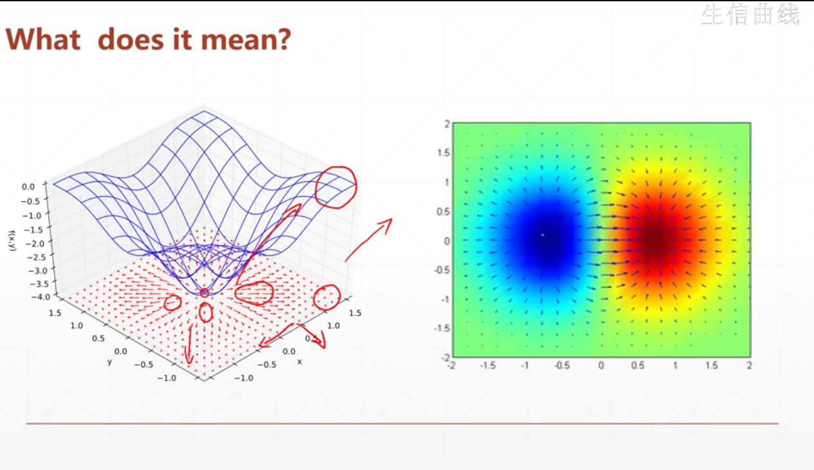

一、计算误差

- logits： 一般指的是神经网络的最后一层（不加激活函数的输出）

- 交叉熵（Entropy）

  -   作为最小化的对象是合理的 

  - 单输出的问题

    

  - tf.losses.categorical_crossentropy  

  - tf.losses.BinaryCrossentropy()[[x1,x2,x3...],[y1,y2,y3...]] ：大写的形式是先简历一个类，然后再传参调用。

    

- logits 和 prob可以直接合并

  

  

二、梯度下降（Gradient Descent）

- 梯度的含义
  - 梯度的方向：表示数值增大的方向
  - 梯度的大小/长度：表示增大的速度

- 用tf.GradientTape() 计算梯度

  - with xx 形式

  - 将计算过程 or 核心函数写入with框架中

  - 用tape.gradient(loss,[w1,b1,w2,b2...])的形式传入loss参数，及需要记录梯度的参数

  - 注意：这里是自动跟踪tf.Variable()类型的变量

    - 1.创建时就从tensor—转化为tf.Variable() 
    - 2.用tape.watch([w1,b1,w2,b2])进行显式跟踪

    

三、反向传播函数

- 激活函数的梯度

  - 为什么要用激活函数？避免不可导？

  - **为什么经常用sigmoid函数**

    - 可以将输出压缩到(0,1)之间

    - 可导，且导数很容易计算

      

  - Tanh激活函数：可以由sigmoid函数推导，区间是（-1，1），性质和sigmoid函数类似

  - Relu激活函数——==当前DL用的非常多的（非常有利于DL）==

    - x > 0 ,梯度为1，x < 0，梯度为0 
    - 容易计算

四、感知机

- 单层单个输出
- 单层多个输出

