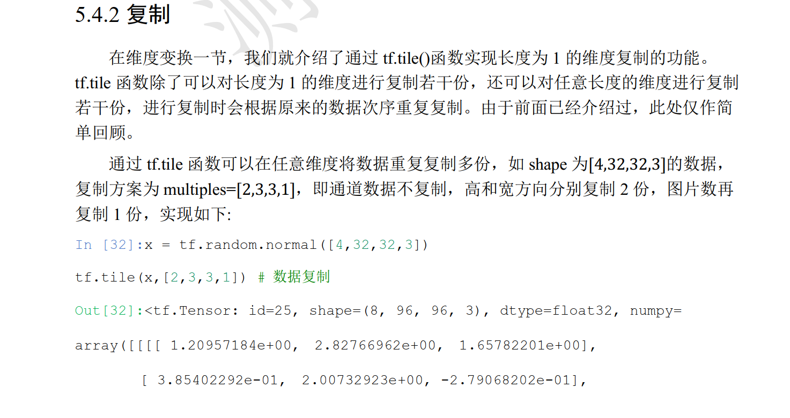

- 范数

  - 1范数：绝对值之和
  - 2范数：平方和开根号
  - 无穷范数：最大值

- ```pyth
  tf.reduce_max, tf.reduce_min
  tf.norm
  tf.argmax,  tf.argmin
  tf.equal
  tf.unique  # 得到tensor中不同元素（去重）
  ```

- 对张量进行排序

  - tf.sort：对元素进行排序；默认axis = -1，即对最后一个维度进行排序
  - tf.argsort：对元素进行排序，得到的是其索引
  - tf.gather：可以利用改函数进行还原 
  - tf.math.top_k

- 张量复制与填充

  - 填充 **tf.pad**

    

  - 复制 **tf.tile** ：是真的在内存中进行复制，和broadcast不同；后者是逻辑上的复制（运算上的复制的运算形式）

    

- 数据的限幅

  - tf.clip_by_value(a, a_min, a_max)：对数据a进行范围限制，使其最小为a_min，最大为a_max；等价于下面两个的组合
    - tf.minmum(a, a_min)
    - tf.maxnum(a, a_max)
  - tf.clip_by_norm
  - tf.clip_by_global_norm(gradients,  clip_norm) ：对全局的梯度，按照等比例的缩放。==可以避免梯度消失or爆炸==

- 高阶操作

  - tf.where(a, mask)

  - 有条件的更新 tf.scatter_nd

    

    

  - tf.mashgrad

  - tf.sigmoid ：将变量的范围压缩到0~1的范围
  
  - tf.nn.softmax：不仅压缩到0~1，其之和等于1
  
  

