###  **一、利用keras的API可以非常方便的创建和使用**

- 预处理数据

  - batch

  - shuffle

  - split

  - convert_to_tensor

    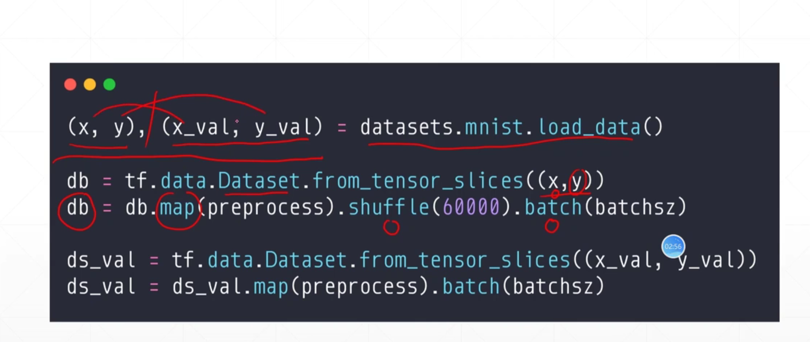

  - 数据划分

    - 训练集 train_db

    - 验证集 val_db

    - 测试集 test_db

      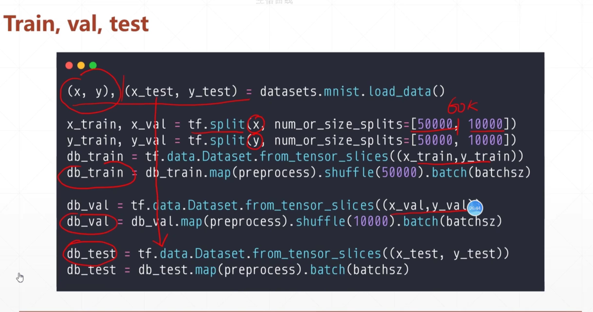

- 自定义层 or 调用现有的层

  - 继承自layers.layer
  - def  __init__ 
  - def call ： 具体实现的运算形式

- 自定义model or 调用现有的model（sequential）

  - 继承自keras.Model
  - def __init__ : 包含构建的网络层信息
  - def  call ： 从输入到输出执行的运算

- 实例化网络 network = MyNetwork()

- 组建网络  network.compile

  - 指定优化器 optimizer = 
  - 指定损失  loss = tf.losses.CategoricalCrossentropy
  - 指定metrics

- 输入train数据，进行训练 network.fit

  - train datebase : 待拟合的数据（已近预处理过，且划分为了batch形式）
  - epochs：指定在数据上需要拟合的轮数
  - validation_data、validation_freq：指定训练过程中用于评估的数据，及其评估的频率

- 输入test数据，进行评估 network.evaluate

  - test_db：用于test的数据（也已经预处理好）

- 保存模型

  - why?为了避免训练过程中意外情况的发生（还没有到迭代结束时发生了中断，所有数据都会丢失），通常在训练过程中，以一定的间隔对模型进行保存，即使发生了意外，也能很快的找回。

  - network.save_weights：只是保存模型中的w,b的参数，==下次用的时候，还是需要重新构建模型==【保存过高效，恢复过程比较复杂】

  - network.save：保存模型的所有参数（包括网络架构，模型参数等），加载时，不需要再次构建网络架构，直接load，就可恢复之前所有信息

    > 模型保存在checkponit 文件中

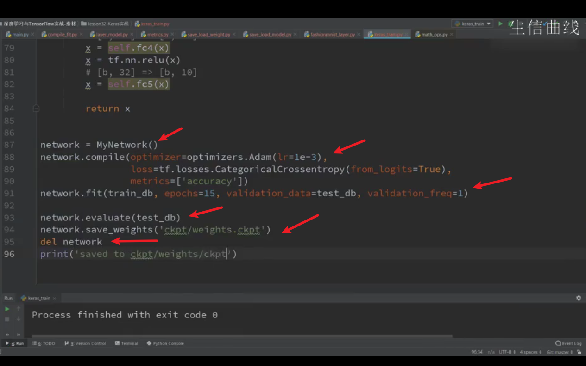

### **二、train evaluation test**

- 在每个epoch进入的时候，进行数据集的划分（train and evaluation）

  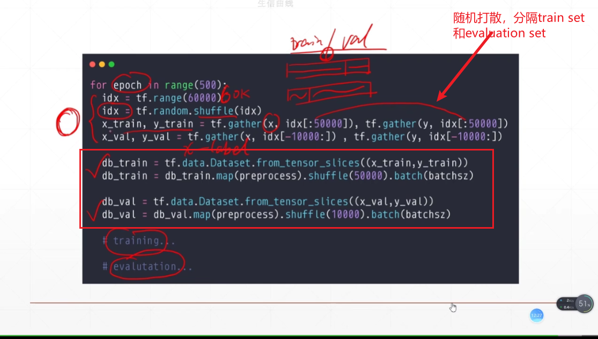

- 直接调用keras的API，指定train set 和evaluation set的比例，方便快捷的进行训练和验证

  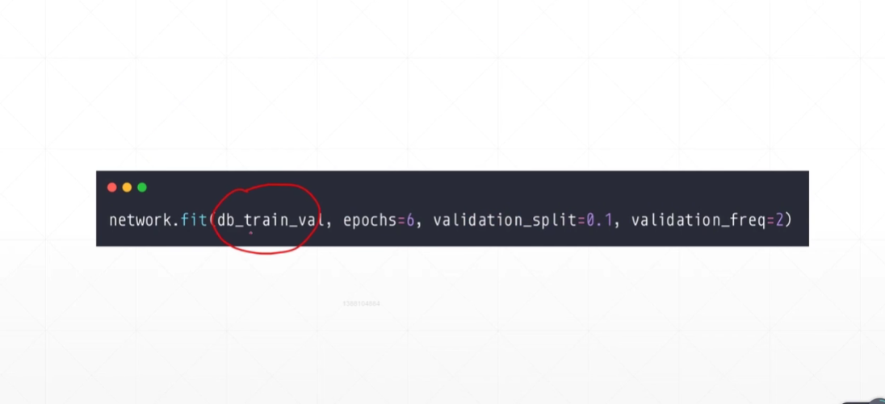

### **三、防止模型overfitting**

- 常用方式

  - more data： 使用更多的数据，可以减少模型的过拟合

  - constraint model  complexity：模型越复杂，参数越多，越容易发生过拟合

    - shallow

    - regularization（minimize的时候，也会尽量使参数的范式足够小）==表现平滑==

      - 表现形式足够强
      - 高维的系数足够小

      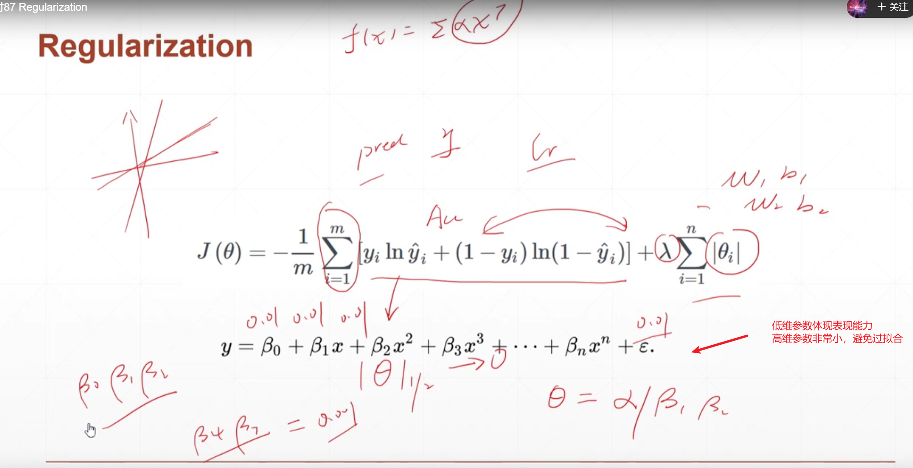

      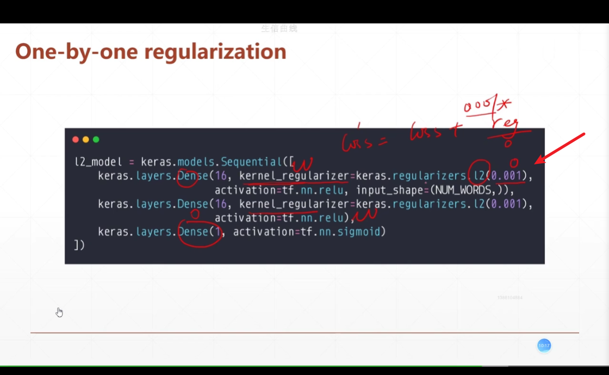

      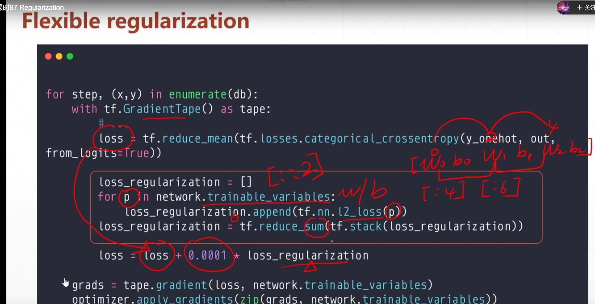

  - Dropout

  - Data argumentation

  - Early Stopping

###  **四、动量和学习率**

- 惯性momentum，一种优化技巧
  - 不加的时候，更新方向为当前的梯度
  - 但是，可能会在前期更新方向变化的非常“尖锐”
  - **==加入momentum之后，会在更新的时候，考虑上一次梯度的方向==**

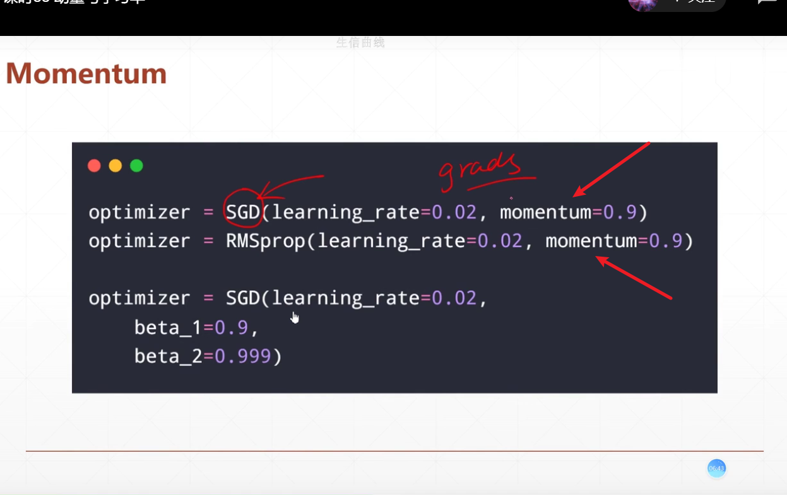

- learning rate :在学习的过程中，learning rate应该刚开的时候大一些，随着训练的过程进行，learning rate应该逐渐减小

  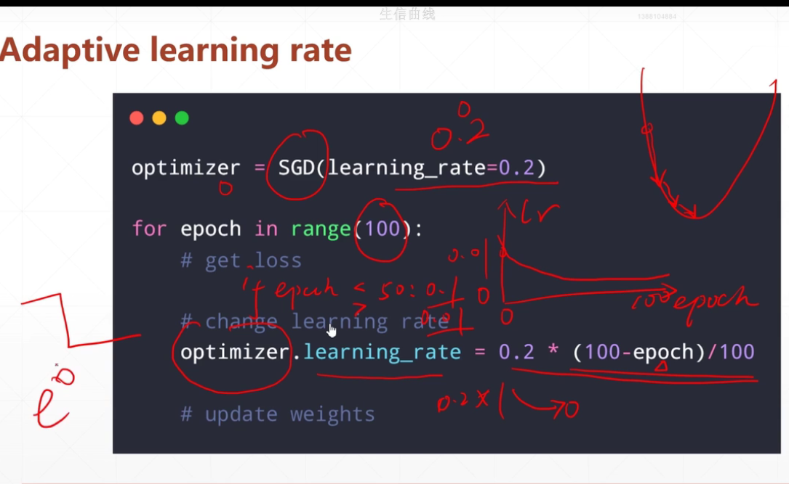

### **五、early stopping、dropout、**

-  early stopping

  - 避免过拟合，在训练在一定的时候就停止
    - 用validation set 来选择模型参数
    - 监测模型在validation set上的表现性能
    - 当性能达到最好的时候，停止训练（==具体什么时候停止、什么条件停止，依靠自己对模型的预估来设置对应的启发式规则（eg：连续5个epoch，validation accuracy没有继续上升，就可以停止了）==）

  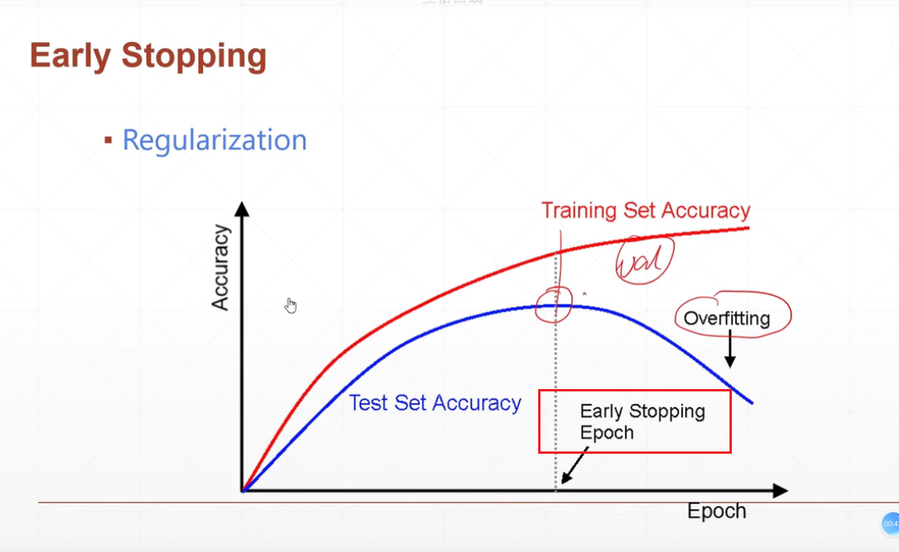

- dropout——==《选择性炼丹说》==，避免over fitting非常简单的说法

  - 实现起来非常简单——直接添加Dropout层

  - 可以提高模型的鲁棒性、泛化性能

  - 加了dropout层，有可能在训练数据上表现的不是很好（训练时间需要比较久），但是一旦训练好了，可以加强第二条

    

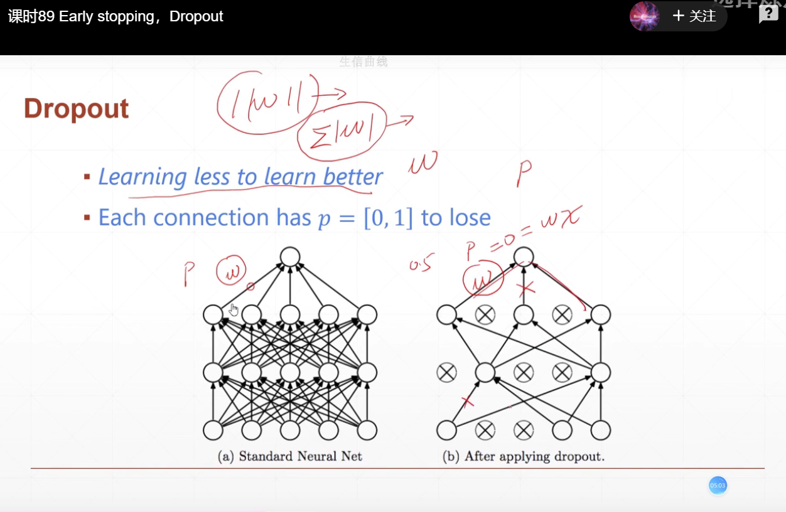

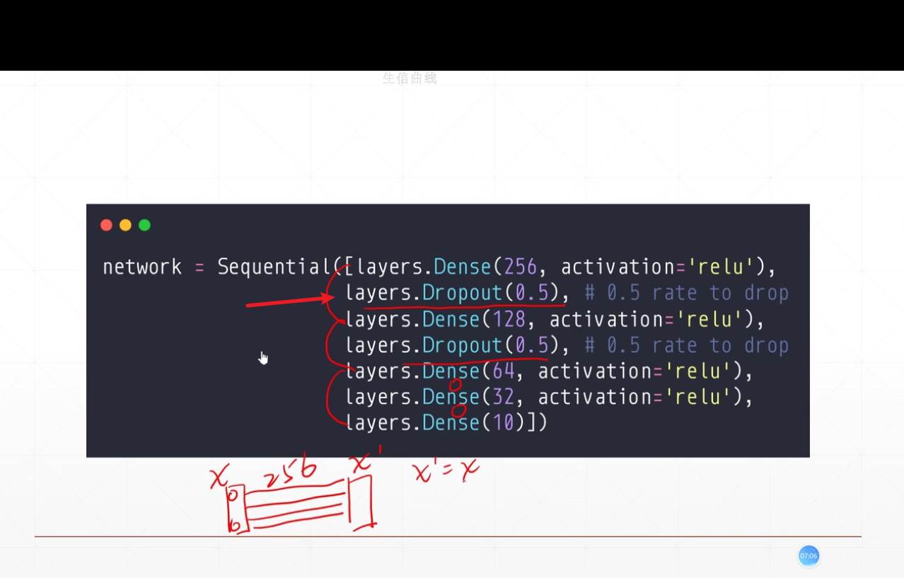

- Stochastic Gradient descent

> 