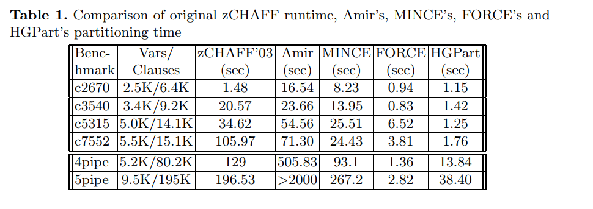
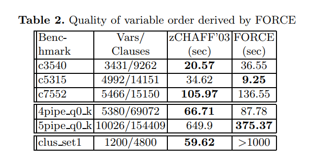

### 基础知识

- LBD

1. glucose系列求解器，是最早提出lbd的概念（主要是用用于衡量learnt clasue的重要性，当lbd<2,这个clause 不会被删除）
2. 关于glue clauese因为能判断其是否满足的variable 联系密切，所以只需要更少的变量赋值就能得出结果（更容易进行propagate和产生conflict），从而有效的减少搜索空间和提高搜索路径的有效性。
3. glue level：variable的属性，代表该变量在当前glue clause中出现了多少次（体现该变量的集中程度）
4. BCE：block clause elimination （消除阻塞字句，一种化简的形式）
   1. blocked clause是?什么是l blocks C
      1. ~l 所在的所有clause和C做resolution化简，得到的都是tautology
      2. ~l和l都属于C，则C为self tautology
   2. 什么是blocked set
      1. 如果一组clauses集合组成的formula可以利用BCE就求出问题的解，说明该F就是blocked set

### 比较公认的评价指标

1. learning rate（conflict clauses /  decisions）: 平均每个决策能学习到多少个clause；学习率越大，表示分支策略越有效。

### 关于变量的顺序

> 是研究sat问题求解的一个重要分支，也是理解CNF、SAT solver结构的一个重要研究点
>
> CNF-SAT中变量、约束的顺序，对于问题每个模块的求解都有影响。主要研究点在用：==variable activity和clause connectivity==作为衡量指标
>
> - 约束连通性（两个变量出现在同一个约束中，表示他们是connected）——【基于此划分】
>
>   - 划分思路：约束表示为超图，分析图的拓扑结构
>     - 利用tree decomposition——minimum tree-width （允许）
>
> - 现在用order思路的局限性
>
>   - 许多提出来找order的观点or方法，(order 时间）> 原始order solve time；==排序不一定快==
>
>   - ==排序快的不一定好==
>   - 特别是对于工业级数据，排序时间消耗难以接受
>   - hard  problem？how tightly connected?！！！！连接紧密的数据本身就比较难，很难实现求解时间的提升。

### Variable Ordering for Effcient SAT Search by Analyzing Constraint-Variable Dependencies

> 主要做法：提出了一种静态的用于确定variable初始顺序的方法
> -  变量的顺序取决于：
>    - 变量的活跃程度、相互之间的连接程度 
>    - ==两个变量度的相关性==（新提出来的一种衡量指标）
> -  具体做法：用上述指标，建立加权图，在通过图的拓扑结构，确定变量的初始顺序

### Characterization of Glue Variables in CDCL SAT Solving 

> 出发点：具有小lbd的clause更有利于问题的求解，所以从该 思路出发，对比发现glue variable vs no glue，带来的更多的inference 、冲突也更有效。
>
> 原来glucose的bump score：increase the scores of variable in a learnted clause that propagate by glue clause
>
> 
>
> ==本文思路==：bump the activity score of  a glue variable based on its ==glue centrality score==（鼓励cdcl在更活跃的节点上分支
>
> 对比求解器：MapleLCMDist （CDCL启发式是三者的结合 VSIDS + LRB + Dist）
>
> 
>
> - 对比指标
>
>   - 到特定decision level，glue variable 和 no glue variable 的占比
>
>   - different type variable带来的propagate和conflict次数——glue variable更多，更有利
>
>   - 选取不同类型变量做分支，得到learnt clause的平均lbd——越小表示学到的更有效
>
>   - 对比17 and 18年比赛数据集，发现分支更倾向于选择glue variable
>
>     
>
> - 做法（一）：在analyze里面发生increase
>
>   - 如果learnt clause是glue clause，所涉及变量的glue level +1
>     - why? 这里面的变量属于最新被赋值的变量，也是最活跃的变量；如果这些变量被撤销赋值，也是最有可能作为下一次分支的候选变量。（所以应该提高其活跃程度）
>
> - 做法（二）：在backtrack里面发生bump
>
>   - glue variable  may generate more blocked variables and create more conflicts
>   - 新得分 = 旧得分  * （1 + glue centrality）

