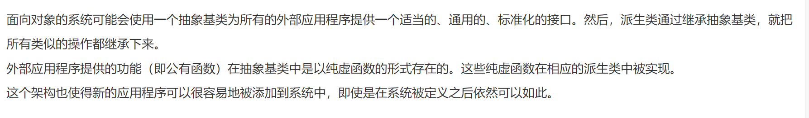
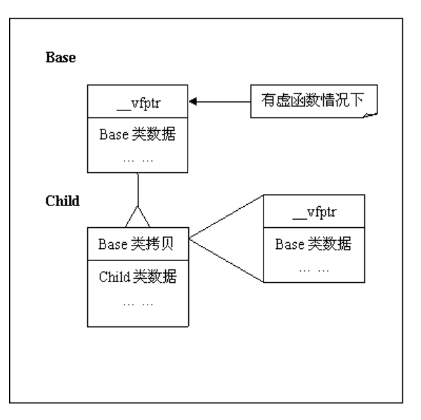
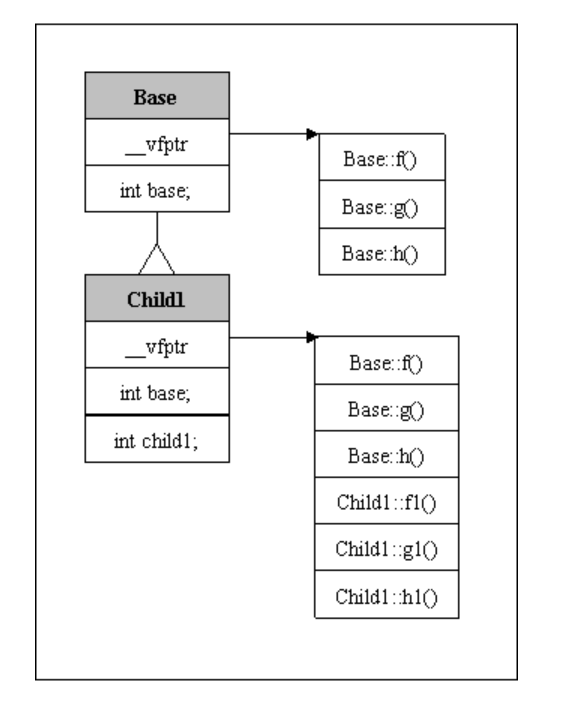
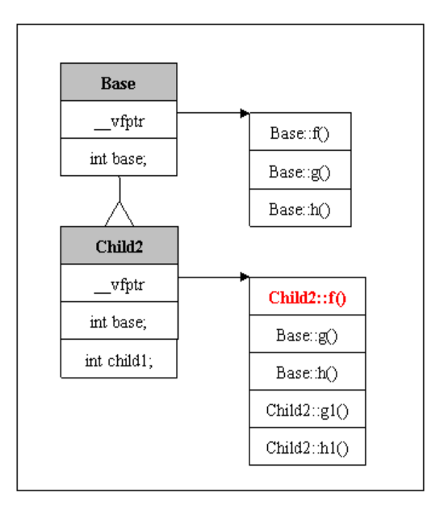
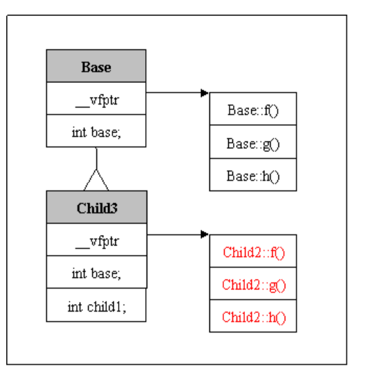

### 抽象类 vs 具体类

- 抽象类中含有纯虚函数，eg：类的方法为==`virtual doubule getVolume()=0`==（后面的等于0，表示纯虚）

  - 纯虚函数，必须在派生类中实现，否则会报错
  - 故，抽象类只能作为接口，不能用来直接实例化对象。

- 设计策略

  

### 虚函数

> 首先区别于几个概念：
>
> - 重载（函数名可以相同，根据参数的不同是实现不同的功能）
> - 覆盖（重写）
> - 多态————就是用虚函数来实现的

参考链接：https://blog.csdn.net/i_chaoren/article/details/77281785

> 最常见的用法就是声明基类的指针，利用该指针指向任意一个子类对象，调用相应的虚函数，动态绑定。由于编写代码的时候并不能确定被调用的是基类的函数还是哪个派生类的函数，所以被成为“虚”函数。如果没有使用虚函数的话，即没有利用C++多态性，则利用基类指针调用相应的函数的时候，将总被限制在基类函数本身，而无法调用到子类中被重写过的函数

```c++
class A{
public:
    void foo(){
        cout << "foo A" << endl;
    }
    
    vritual void func(){   // 表明为虚函数，允许子类进行多态
        cout << "fun A" << endl;
    }
    
}

class B:public A{
public:
    void foo(){
        cout << "foo B" << endl;
    }
    
    void func(){  // 虚函数多态
        cout << "func B << endl;
    }
}


int main(){
    A a;
    B b;
    A *p = &a;
    p -> foo();  // foo A
    p -> func(); // foo A
    
    *p = &b;
    p -> foo();   // foo A  取决于指针的类型，这里this的类型为A，则调用的是A的foo函数
    p -> func();  // foo B  虚函数允许利用基类的指针调用子类的函数
}
```

### c++中类对象内存结构

[参考链接](https://blog.csdn.net/fenxinzi557/article/details/51995911?utm_medium=distribute.pc_relevant_t0.none-task-blog-2%7Edefault%7EBlogCommendFromMachineLearnPai2%7Edefault-1.control&depth_1-utm_source=distribute.pc_relevant_t0.none-task-blog-2%7Edefault%7EBlogCommendFromMachineLearnPai2%7Edefault-1.control)

几个关键点：

- 类【对象】存储的是类的【数据】 + 虚函数表的【指针】（如果有虚函数的情况下）

- 类对象数据在存储时，有一个==数据对齐观点==

  

  - 无虚函数重载——子类的虚函数表中，先存放基类的虚函数，在存放子类自己的虚函数

    

  - 部分重载父类虚函数——替换重载的函数

    

  - 全部重载——全部替换

    

