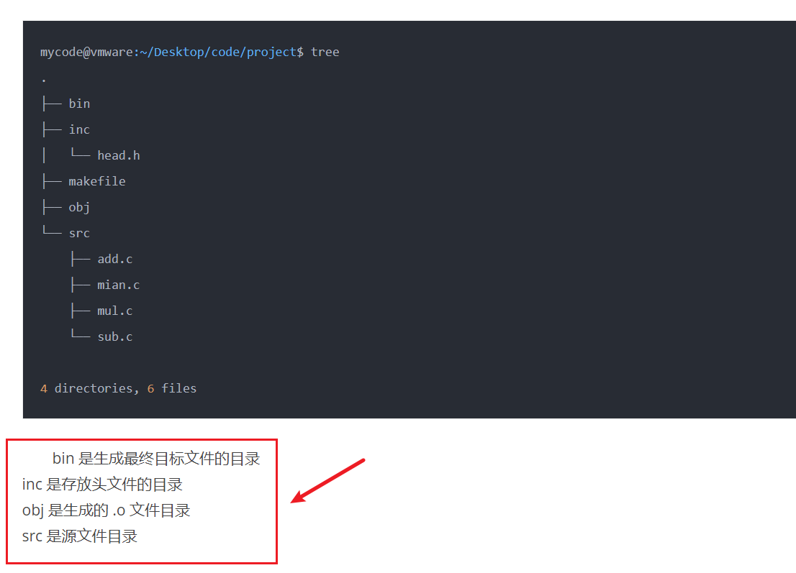
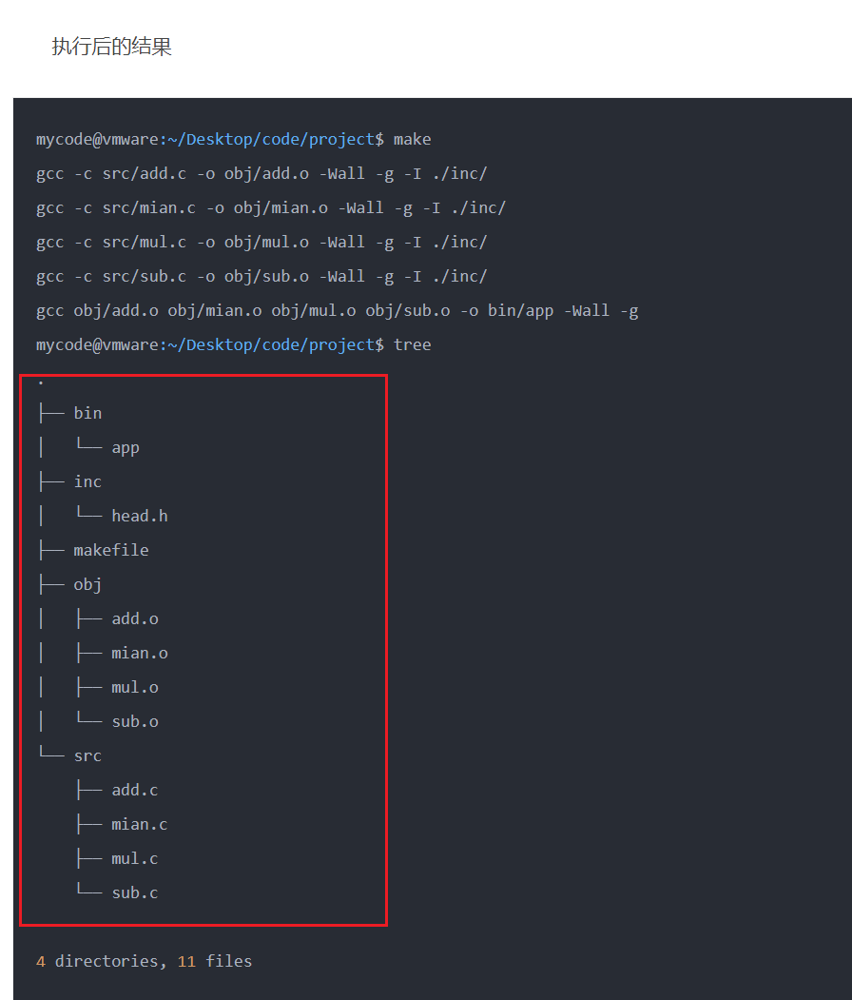

### make基本知识

> 在工程性编程中，通常涉及多个文件之间相互依赖的关系，手动编译常常会非常麻烦（特别是对某些文件进行修改之后，需要重新编译的时候）。make相当于指定通用的编译规则，当所依赖的文件有更新时，才会对更新的文件进行重新编译。==避免无用的重复编译==

```make
# 基本形式
# command表示一行或多行shell指令，表示构建target的具体指令
# 命令之前必须有tab，表示这是一条command。（也可以用RECIPEPREFIX来自定义）
# 多行shell，不能相互继承，这些命令会被放到单独的shell中去执行（不同进程）；可以放在一行用;或\转义来表示不同的命令（在同一个shell）
<target> : <prerequisites>
[table] <commands>

# PHONY表示后面跟的是伪指令（clean不是文件，只要显示的调用make clean 就会触发后面的rm指令）
# 没有前置条件，表示该文件不依赖于任何文件，只要其不存在就会执行
# 有前置条件时，首先判断前置文件的最后修改时间与target生成时间，如果小于，则表示没有更新，不重新执行。make -B可以强制覆盖

.PHONY clean
clean:
	rm *.o 
```

- command如何在同一个shell执行
  - 放在同一行，用;分隔
  - 不同行，行尾用\表示续行
  - 在target：pre...之前，用`.ONESHELL`显示指定

- 一些表示
  - 【避免回显命令】make默认会在terminal中回显所执行的command，在command前加@，可以不回显。
  - 【大量文件匹配】%.o: %.c    表示对所有.c文件执行命令，生成.o文件
  - $(cc)表示当前编译器；
  - $@：当前target文件
  - $<：第一个前置条件文件
  - $^：所有前置条件文件
  - $？：比target还新的所有前置文件
  - $*：表示%匹配的部分
- make的一些参数
  - make -B ：强制重新执行命令，不管时间戳的关系
  - make -d ：打印调试详细信息
  - make -c：显示指定makefile路径（默认为当前文件夹下）
  - make -f：显示指定makefile文件名称（默认为makefile、Makefile）

```shell
CXX=g++
CPPFLAGES= -g -O0 -Wall

TARGETS=main
CPP_SRCS=$(foreach dir, ., $(wildcard $(dir)/*.cpp))
OBJS=$(patsubset %.cpp, %.o, $(CPP_SRCS))

all:TARGETS        # make默认第一个目标是最终生成目标，若顺序写错了，将会引起错误；可以用all显示的指定

$(TARGETS):$(OBJS)
	$(CXX) $(CPPFLAGS) $(OBJS) -O $@      # 注意main文件依赖于所有的.o文件，所以用$(OBJS)全量输入
$(OBJS):$(CPP_SRCS)
	$(CXX) $(CPPFLAGS) $< -C -O $@		 # .o文件不存在，往下找.o文件的生成规则
	
%.o : %.c
	$(CXX) $(CPPFLAGES) $< -c -o $@      #好象这样比上一行写的形式更好？
```

- 举个例子

  - 常规的文件结构

  

  - makefile文件——==主要指定路径==

```she
src = $(wildcard ./src/*.c)
obj = $(patsubst ./src/%.c, ./obj/%.o, $(src))
inc = ./inc/

CC = gcc
CFLAGS = -Wall -g
CPPFLAGS = -I

all:./bin/app

./bin/app:$(obj)
    $(CC) $^ -o $@ $(CFLAGS)

./obj/%.o:./src/%.c
    $(CC) -c $< -o $@ $(CFLAGS) $(CPPFLAGS) $(inc)

clean:
    -rm -rf $(obj) ./bin/app

.PHONY:clean all
```

- 执行后的结果——==文件按照类型放到不同的文件夹中，有利于管理==

  


### 主要分为三部分模板

- 生成可执行文件
- 静态库
- 动态库

```she
######################################
#   可执行文件
######################################
#source file
#源文件，自动找所有.c和.cpp文件，并将目标定义为同名.o文件
SOURCE  := $(wildcard *.c) $(wildcard *.cpp)
OBJS    := $(patsubst %.c,%.o,$(patsubst %.cpp,%.o,$(SOURCE)))
  
#target you can change test to what you want
#目标文件名，输入任意你想要的执行文件名
TARGET  := test
  
#compile and lib parameter
#编译参数
CC      := gcc
LIBS    :=
LDFLAGS :=
DEFINES :=
INCLUDE := -I.
CFLAGS  := -g -Wall -O3 $(DEFINES) $(INCLUDE)
CXXFLAGS:= $(CFLAGS) -DHAVE_CONFIG_H
  
  
#i think you should do anything here
#下面的基本上不需要做任何改动了
.PHONY : everything objs clean veryclean rebuild
  
everything : $(TARGET)
  
all : $(TARGET)
  
objs : $(OBJS)
  
rebuild: veryclean everything
                
clean :
    rm -fr *.so
    rm -fr *.o
    
veryclean : clean
    rm -fr $(TARGET)
  
$(TARGET) : $(OBJS)
    $(CC) $(CXXFLAGS) -o $@ $(OBJS) $(LDFLAGS) $(LIBS)


######################################
#    静态库
#
######################################
  
#target you can change test to what you want
#共享库文件名，lib*.a
TARGET  := libtest.a
  
#compile and lib parameter
#编译参数
CC      := gcc
AR      = ar
RANLIB  = ranlib
LIBS    :=
LDFLAGS :=
DEFINES :=
INCLUDE := -I.
CFLAGS  := -g -Wall -O3 $(DEFINES) $(INCLUDE)
CXXFLAGS:= $(CFLAGS) -DHAVE_CONFIG_H
  
#i think you should do anything here
#下面的基本上不需要做任何改动了
  
#source file
#源文件，自动找所有.c和.cpp文件，并将目标定义为同名.o文件
SOURCE  := $(wildcard *.c) $(wildcard *.cpp)
OBJS    := $(patsubst %.c,%.o,$(patsubst %.cpp,%.o,$(SOURCE)))
  
.PHONY : everything objs clean veryclean rebuild
  
everything : $(TARGET)
  
all : $(TARGET)
  
objs : $(OBJS)
  
rebuild: veryclean everything
                
clean :
    rm -fr *.o
    
veryclean : clean
    rm -fr $(TARGET)
  
$(TARGET) : $(OBJS)
    $(AR) cru $(TARGET) $(OBJS)
    $(RANLIB) $(TARGET)
    
    
    
    
######################################
#
#  动态库
######################################
  
#target you can change test to what you want
#共享库文件名，lib*.so
TARGET  := libtest.so
  
#compile and lib parameter
#编译参数
CC      := gcc
LIBS    :=
LDFLAGS :=
DEFINES :=
INCLUDE := -I.
CFLAGS  := -g -Wall -O3 $(DEFINES) $(INCLUDE)
CXXFLAGS:= $(CFLAGS) -DHAVE_CONFIG_H
SHARE   := -fPIC -shared -o
  
#i think you should do anything here
#下面的基本上不需要做任何改动了
  
#source file
#源文件，自动找所有.c和.cpp文件，并将目标定义为同名.o文件
SOURCE  := $(wildcard *.c) $(wildcard *.cpp)
OBJS    := $(patsubst %.c,%.o,$(patsubst %.cpp,%.o,$(SOURCE)))
  
.PHONY : everything objs clean veryclean rebuild
  
everything : $(TARGET)
  
all : $(TARGET)
  
objs : $(OBJS)
  
rebuild: veryclean everything
                
clean :
    rm -fr *.o
    
veryclean : clean
    rm -fr $(TARGET)
  
$(TARGET) : $(OBJS)
    $(CC) $(CXXFLAGS) $(SHARE) $@ $(OBJS) $(LDFLAGS) $(LIBS)
```

